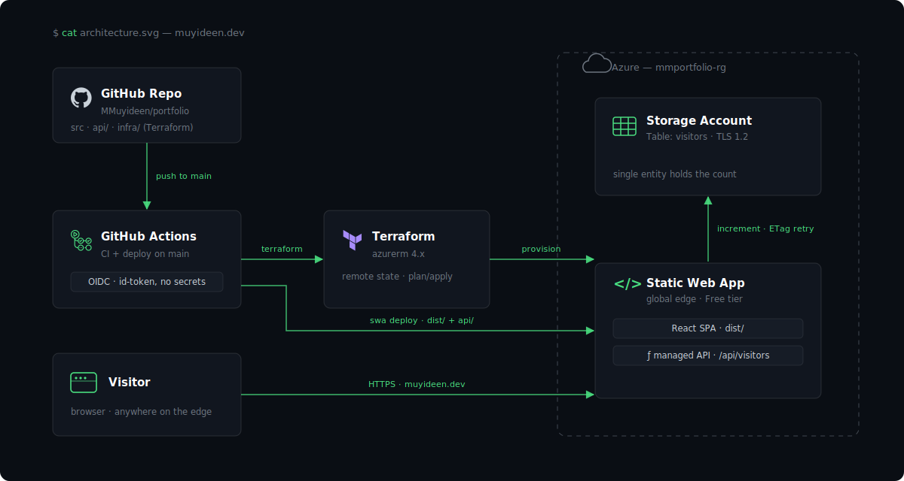

# Muyideen Morenigbade — Portfolio

Personal portfolio and blog for a DevOps & Cloud Engineer, live at [muyideen.dev](https://www.muyideen.dev). React + Vite + TypeScript + Tailwind CSS, hosted on Azure Static Web Apps, managed with Terraform, deployed via GitHub Actions using OIDC (no long-lived cloud secrets). The site is its own case study: the visitor counter on the home page is a managed Azure Function backed by Table Storage, provisioned by the Terraform in this repo.

## Architecture



## Stack

| Layer | Choice |
|---|---|
| Frontend | React 18, Vite 5, TypeScript, Tailwind CSS, Framer Motion |
| Blog | Markdown posts compiled at build time (folder per post, images co-located) |
| API | Azure Functions (SWA managed) + Table Storage visitor counter |
| Hosting | Azure Static Web Apps (Free tier) |
| IaC | Terraform ≥ 1.7, `azurerm 4.80.0`, remote state in Azure Storage |
| CI/CD | GitHub Actions — CI on every branch/PR, deploy on `main` via OIDC |

## Repository layout

```
src/
├── components/        # UI (Hero, Projects, SectionHeader, …)
├── content/posts/     # blog: one folder per post (index.md + images)
├── data/portfolio.ts  # ALL editable site content
├── lib/               # posts loader, markdown renderer, motion tokens
└── pages/             # Home, BlogIndex, BlogPost, NotFound
api/visitors/          # visitor-counter Azure Function
infra/                 # Terraform (resource group, SWA, counter storage)
public/
├── diagrams/          # project architecture diagrams
└── certifications/    # certification badge images
scripts/               # sitemap.xml + rss.xml generation (runs pre-build)
```

---

## Local development

```bash
npm install
npm run dev        # http://localhost:5173
npm run build      # sitemap + rss → typecheck → production build → dist/
npm run typecheck  # tsc --noEmit
npm run lint       # ESLint (warnings are errors)
npm run sitemap    # regenerate public/sitemap.xml + public/rss.xml only
```

---

## Customising content

All editable site content lives in one file: **`src/data/portfolio.ts`**.

| Field | What to change |
|---|---|
| `role`, `email`, `github`, `linkedin` | Identity and contact links |
| `projects[]` | Add/edit/remove projects |
| `certifications[]` | Add/edit/remove certs |
| `experience[]`, `education[]`, `skills[]` | Timeline, schools, tech stack |

### Adding a project

Drop the architecture diagram in `public/diagrams/` and reference it:

```ts
{
  id: 'my-project',              // kebab-case, unique
  title: 'My Project',
  command: 'run my-project',     // shown as: $ run my-project
  description: [
    '# One-line summary as a comment.',
  ],
  stack: ['Terraform', 'Azure'], // shown as mono tags
  links: [
    { label: 'GitHub', href: 'https://github.com/...', external: true },
  ],
  diagram: '/diagrams/my-project.png',  // optional; omit for a stack panel
},
```

The projects section shows the first 4 entries with a "show all" expander.

### Adding a certification

Drop the badge in `public/certifications/` and reference it:

```ts
{
  issuer: 'Microsoft',
  title: 'AZ-500 Azure Security Engineer Associate',
  date: '2025-01',
  verifyUrl: 'https://learn.microsoft.com/api/credentials/share/YOUR_ID',
  badgeImage: '/certifications/az-500.png',  // optional; Credly URLs fall back automatically
},
```

---

## Writing a blog post

Each post is a **folder** under `src/content/posts/` containing an `index.md` and any images it uses:

```
src/content/posts/
└── my-post-slug/          # folder name = URL slug (/blog/my-post-slug)
    ├── index.md
    ├── image-01.png
    └── image-02.png
```

`index.md` starts with frontmatter:

```markdown
---
title: "My Post Title"
date: "2026-07-09"
excerpt: "One-sentence summary shown on cards and in the RSS feed."
tags: ["Azure", "Terraform"]
draft: true            # flip to false to publish
---

Body in markdown. Reference co-located images relatively:


```

Notes:

- **`draft: true` posts are invisible everywhere** — site, sitemap, and RSS. Flip to `false` to publish.
- Relative image references (`./image.png`) are resolved at build time to hashed, lazy-loaded assets. Keep images in the post's own folder — no external hot-linking (the CSP blocks it).
- Frontmatter is parsed at build time by the `post-meta` Vite plugin (`vite.config.ts`); post bodies are code-split so the home page never downloads them.
- Reading time is estimated automatically (override with `readingTime: N` in frontmatter).
- `sitemap.xml` and `rss.xml` regenerate on every build — nothing to hand-maintain.

---

## First-time infrastructure setup

### 1. Bootstrap remote state (run once)

```bash
az login
az account set --subscription "<SUBSCRIPTION_ID>"

az group create \
  --name terraform-backend-rg \
  --location westeurope

az storage account create \
  --name deenterraformstate \
  --resource-group terraform-backend-rg \
  --location westeurope \
  --sku Standard_LRS \
  --min-tls-version TLS1_2 \
  --allow-blob-public-access false

az storage container create \
  --name tfstate \
  --account-name deenterraformstate

az storage account blob-service-properties update \
  --account-name deenterraformstate \
  --resource-group terraform-backend-rg \
  --enable-versioning true
```

(Names must match `infra/backend.tf`.)

### 2. Apply Terraform

```bash
cd infra
cp example.tfvars terraform.tfvars  # edit: fill in subscription_id
terraform init
terraform plan -var-file=terraform.tfvars
terraform apply -var-file=terraform.tfvars
```

This provisions the resource group, the Static Web App (with custom domains from `var.custom_domains`), and the visitor-counter storage account whose connection string is wired into the SWA app settings automatically.

---

## GitHub Actions configuration

Two workflows:

- **`ci.yml`** — lint, typecheck, and build on every pull request and every non-`main` branch push. No cloud access needed.
- **`deploy.yml`** — on push to `main`: `terraform apply`, then build and deploy to SWA. Authenticates to Azure with `azure/login` via **OIDC federated identity** — GitHub mints a short-lived token per run; the three Azure values below are identifiers, not credentials.

Set these in **Settings → Secrets and variables → Actions** (all as **secrets**, matching `deploy.yml`):

| Secret | Value |
|---|---|
| `AZURE_CLIENT_ID` | Entra app registration (with federated credentials for this repo) |
| `AZURE_TENANT_ID` | Entra tenant ID |
| `AZURE_SUBSCRIPTION_ID` | Target subscription |
| `AZURE_STATIC_WEB_APPS_API_TOKEN` | SWA deployment token (Portal → SWA → Manage deployment token) |

Dependabot (`.github/dependabot.yml`) watches npm (root and `api/`), GitHub Actions, and the Terraform providers weekly.

---

## Security posture

- **OIDC-only cloud auth** in CI — no service-principal secrets stored in GitHub.
- **Security headers** served via `public/staticwebapp.config.json`: a Content-Security-Policy locked to same-origin (plus Credly for badge fallbacks), `nosniff`, `frame-ancestors 'none'`, referrer and permissions policies.
- **Markdown is rendered with raw HTML disabled** and code blocks escaped; external links get `rel="noopener noreferrer"`.
- Visitor-counter storage enforces TLS 1.2 and is scoped to a single-purpose account.

---

## Custom domains

Domains are managed by Terraform through `var.custom_domains` (map of domain → validation type):

```hcl
custom_domains = {
  "muyideen.dev"     = "dns-txt-token"      # apex
  "www.muyideen.dev" = "cname-delegation"   # subdomain
}
```

Create the DNS records at your registrar — the CNAME target is `terraform output swa_default_host_name`, and the apex TXT validation token is in `terraform output -json custom_domain_validation_tokens` (it's marked sensitive, so the plain output prints a placeholder). Azure issues the managed TLS certificate once DNS propagates.

---

## Troubleshooting

**`terraform init` fails with auth error**
Run `az login` and `az account set --subscription <ID>` first. The azurerm backend uses your local Azure CLI credentials.

**`AADSTS70011` / OIDC login fails in CI**
The workflow needs `permissions: id-token: write`, and the Entra app registration needs a federated credential matching this repo and `ref:refs/heads/main`.

**Terraform apply fails: `insufficient privileges`**
The OIDC service principal needs Contributor on the resource group: `az role assignment list --assignee <client-id>`.

**SWA deploy exits 0 but the site shows old content**
CDN propagation takes up to ~2 minutes on the Free tier — wait and hard-refresh.

**A new blog post doesn't appear**
Check `draft: false` in its frontmatter, and that the folder contains an `index.md`. Drafts are excluded from the site, sitemap, and RSS.

**Images in a post render as broken**
Reference them relatively (`./image-01.png`) from inside the post's folder. External image hosts are blocked by the CSP by design.

**Local build passes but CI lint fails**
Run `npm run lint` locally before pushing — ESLint runs with `--max-warnings 0`, so warnings fail CI.
