Hello There, I am participating in [10 weeks of CloudOps Challenge](https://github.com/piyushsachdeva/10weeksofcloudops/blob/main/README.md) by [Piyush Sachdeva](https://www.linkedin.com/in/piyush-sachdeva/) and I am excited to share my journey through the fourth week's challenge with you all.

**INTRODUCTION**

Our task for this challenge was to deploy a two tier web Application to AWS using Terraform. The challenge aim to

**Architecture Overview**

Before we dive into the task, here's a quick look at the architecture we aimed to build.

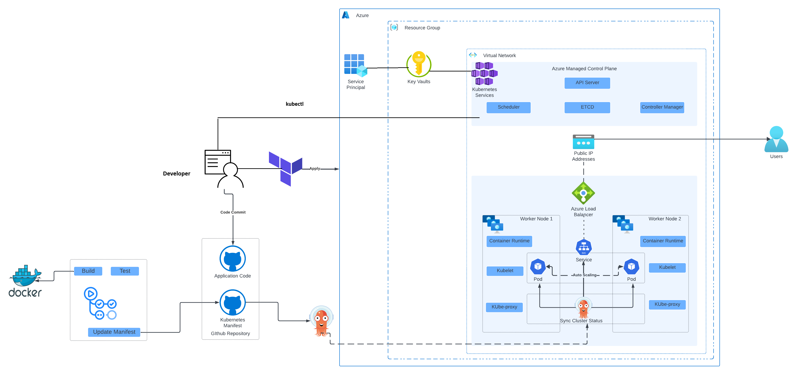

In this architecture, we deployed Azure Kubernetes Services using Terraform, we use Github Actions to dockerize the webapp, push to a container registry (Docker hub). ArgoCD will use the manifests to maintain a desired state with the AKS cluster.

### PART 1: PROVISIONING AKS CLUSTER

To provision the Kubernetes cluster in Azure, we will use terraform for the deployment, you can find terraform modules for the deployment [here](https://github.com/MMuyideen/Azure-cloudops-week4/tree/master/Terraform).

First, we need to set the remote backend where the terraform state file will be saved. we create an Azure Storage account and container then update the `backend.tf` file.

```bash
#!/bin/bash


# Login to Azure (if not already logged in)
# az account show 1> /dev/null || az login   Already logged in on local environment

rg=tf-week4-state-rg
sa=tfpracticestorageweek4
container=tfpracticecontainer

# Resource group
az group create --name $rg --location eastus --tags 'Project=Clodopsweek-4' 'Env=Demo'

# account
az storage account create --resource-group $rg --name $sa --sku Standard_LRS --encryption-services blob

# container
az storage container create --name $container --account-name $sa
```

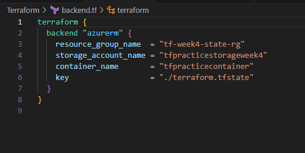

Then we deploy the resources by running the `terraform init`, `terraform plan` and `terraform apply -auto-approve` commands to deploy the resources. The modules also include Keyvault and Microsoft Entra Service Principal. The service principal will store its secrets in Azure keyvault. The Kubernetes cluster will use the service principal identity to create its dependent resources.

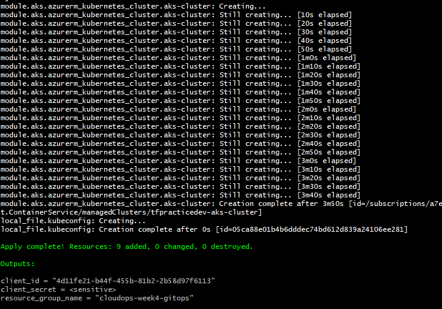

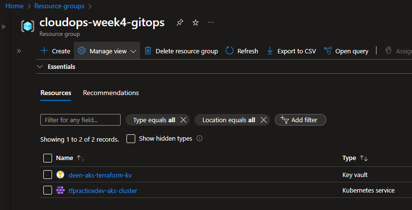

**Dependencies.**

The service principal will create other resources which will be used by the cluster in another resource group. (Managed Identity can also be used)

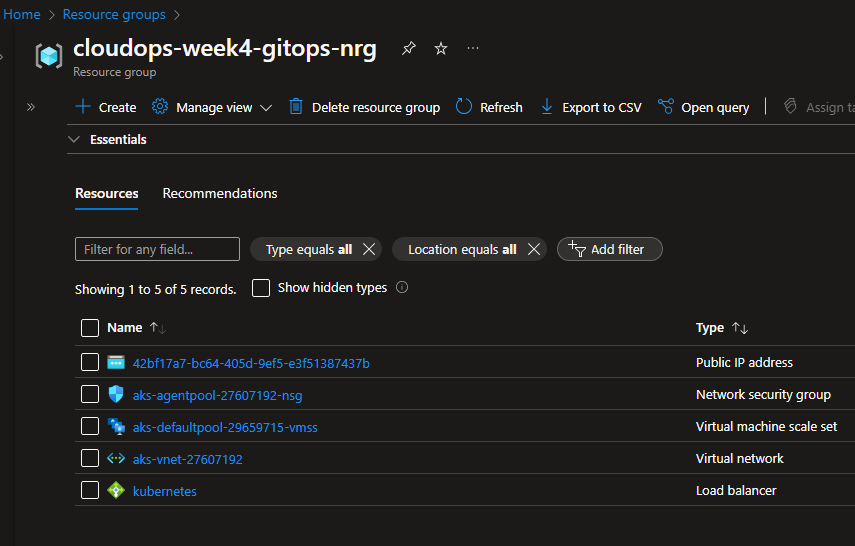

### APP SETUP

Now we setup the App to be containerized. For this deployment, I decided to use python to serve static website. [https://github.com/MMuyideen/Azure-cloudops-week4/tree/master/APP](https://github.com/MMuyideen/Azure-cloudops-week4/tree/master/APP)

we create the Dockerfile which will be used to build the container image.

```dockerfile
# Use the official Python image as the base image
FROM python:3.9-slim

# Set the working directory in the container
WORKDIR /app

# Copy the requirements file and install dependencies
COPY requirements.txt
RUN pip install --no-cache-dir -r requirements.txt

# Copy the application code
COPY . .

# Start the application
CMD ["python", "app.py"]
```

we will now build our container image by running the `docker bulid` command

```bash
docker build -t web-app .
```

Optionally we can test locally by running the `docker run` command

```bash
docker run -p 5000:5000 web-app
```

Then we tag and push the image to docker hub.

```bash
docker tag deenk8s-webapp fullbloodprince/deenk8s-webapp
docker push fullbloodprince/deenk8s-webapp
```

Next is to setup the Kubernetes manifest. this can be in another repository but for this deployment we will use the same repository and creating a new folder name kube\_manifest and creating both the `deployment.yaml` and `service.yaml` file.

But before that we need to ensure that kubectl will use the right K8S cluster configuration.

we created a resource in our terraform configuration that automatically fetches and saves the content of the kubeconfig file into a new file named `kubeconfig`.

we run the command in the terraform project directory to move the kubeconfig to enable the kubectl command apply configuration to the correct AKS instance

```bash
mv ./kubeconfig ~/.kube/config
```

**deployment.yaml**

```yaml
apiVersion: apps/v1
kind: Deployment
metadata:
  name: deenk8s-webapp
spec:
  replicas: 2
  selector:
    matchLabels:
      app: deenk8s-webapp
  template:
    metadata:
      labels:
        app: deenk8s-webapp
    spec:
      containers:
      - name: deenk8s-webapp
        image: fullbloodprince/deenk8s-webapp:59cde845
        ports:
        - containerPort: 5000
```

**service.yaml**

```yaml
apiVersion: v1
kind: Service
metadata:
  name: deenk8s-webapp
spec:
  selector:
    app: deenk8s-webapp

  type: LoadBalancer
  ports:
  - port: 80
    protocol: TCP
    targetPort: 5000
```

Finally in this step, we set up the CI pipeline using Github Actions.

we create a .github/workflows directory in the repository.

```yaml
name: Docker Build and Deploy

on:
  push:
    branches:
      - master

env:
  IMAGE_NAME: deenk8s-webapp
  DOCKER_HUB_USERNAME: fullbloodprince

jobs:

  build-and-push:
    runs-on: ubuntu-latest

    steps:
    - name: Checkout code
      uses: actions/checkout@v3

    - name: Docker login
      run: docker login -u ${{ env.DOCKER_HUB_USERNAME }} -p ${{ secrets.DOCKER_ACCESS_TOKEN }}

    - name: Build and push Docker image
      run: |
        pwd
        docker build -t ${{ env.DOCKER_HUB_USERNAME }}/${{ env.IMAGE_NAME }}:${GITHUB_SHA::8} ./APP/
        docker push ${{ env.DOCKER_HUB_USERNAME }}/${{ env.IMAGE_NAME }}:${GITHUB_SHA::8}

    - name: Update Kubernetes manifest
      run: |
        IMAGE_TAG=${GITHUB_SHA::8}
        sed -i "s|image: .*|image: ${{ env.DOCKER_HUB_USERNAME }}/${{ env.IMAGE_NAME }}:$IMAGE_TAG|" kube_manifest/deployment.yaml 

    - name: Commit and push manifest changes 
      run: |
        git config --global user.name 'GitHub Actions'
        git config --global user.email 'github-actions@github.com'
        git add kube_manifest/deployment.yaml
        git commit -m "Update image tag in deployment.yaml"
        git push
```

Github Actions is going to login to dockerhub where the code and rebuild, tag and push the new image to docker hub. then update the manifest with the new image name.

we create a new access token on docker hub for github action to authenticate with. To create an access token on Docker, login to docker hub. click on the avatar at the top right corner then My Account&gt;Security and create new access token.

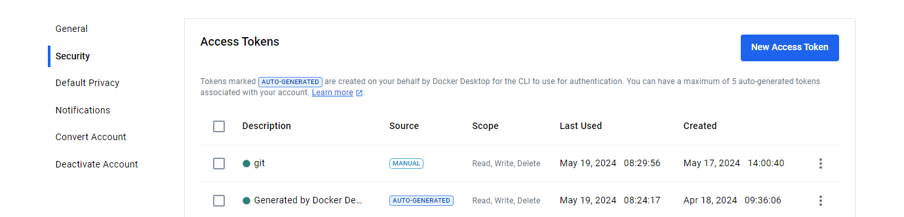

Then we create a new secret with the access token on github

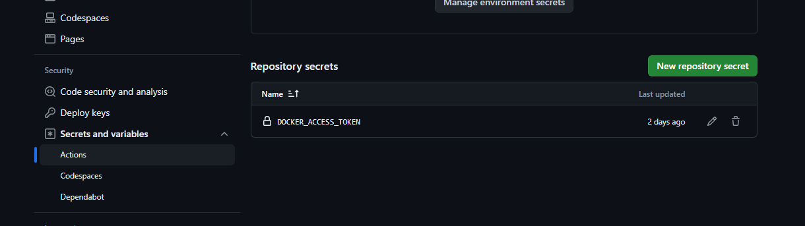

Then we make sure that github Actions can modify code on our behalf by giving it permission. Navigate to repository settings and click on Actions&gt;Genaral on the left pane. at the bottom we give it Read and write permission.

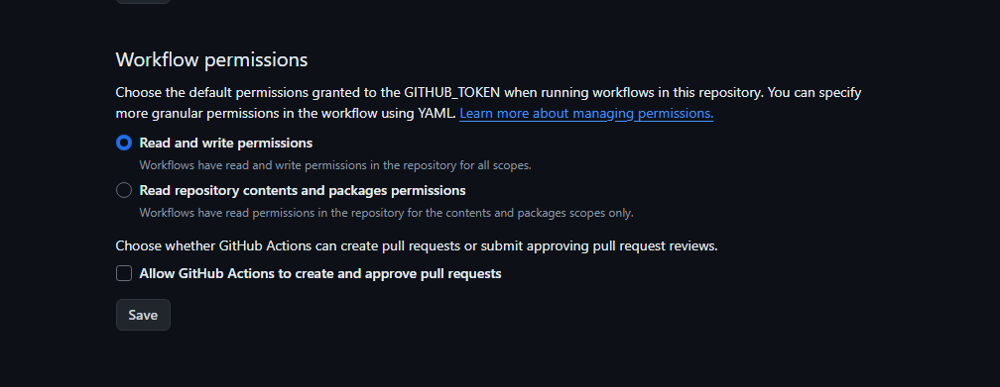

### INSTALLING ARGOCD IN AKS CLUSTER

Finally we are ready to setup ArgoCD in our cluster to sync cluster state.

we do that by completing the following steps

* Creating an ArgoCD Namespace and Installing ArgoCD
    
* Patching ArgoCD Server to use a load balancer and Obtaining the Server IP and Password
    
* Creating and Applying the ArgoCD Sync Manifest File
    

```bash
kubectl create namespace argocd
kubectl apply -n argocd -f https://raw.githubusercontent.com/argoproj/argo-cd/stable/manifests/install.yaml

kubectl patch svc argocd-server -n argocd -p '{"spec": {"type": "LoadBalancer"}}'

ARGO_SERVER_IP=$(kubectl get svc argocd-server -n argocd -o jsonpath='{.status.loadBalancer.ingress[0].ip}') # Get argocd server ip
ARGOCD_PASSWORD=$(kubectl -n argocd get secret argocd-initial-admin-secret -o jsonpath="{.data.password}" | base64 -d) #get argocd server password
echo "ARGOCD_SERVER IP: $ARGO_SERVER_IP"
echo "ARGOCD_SERVER PASSWORD: $ARGOCD_PASSWORD"
```

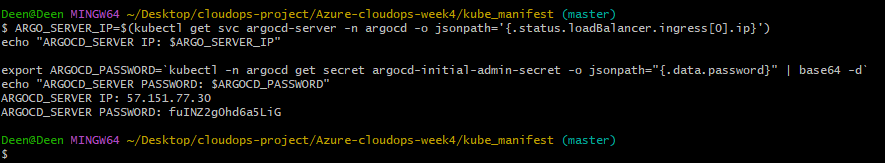

For the argocd manifest file, we craete a new file in the `kube_manifest` directory named `argo-sync.yaml`.

```yaml
apiVersion: argoproj.io/v1alpha1
kind: Application
metadata:
  name: deenk8s-webapp
  namespace: argocd
spec:
  project: default

  source:
    repoURL: https://github.com/MMuyideen/Azure-cloudops-week4.git
    targetRevision: HEAD
    path: kube_manifest/
  destination: 
    server: https://kubernetes.default.svc
    namespace: deenk8s-webapp

  syncPolicy:
    syncOptions:
    - CreateNamespace=true

    automated:
      selfHeal: true
      prune: true
```

make sure to replace the repoURL value with your kube manifest repository and the path to properly reference the location of the files.

`kubectl apply -f app-sync.yaml`

we can now login to ArgoCd to see the configuration. Navigate to the server ip we got earlier, admin is the default username and the server password we got earlier.

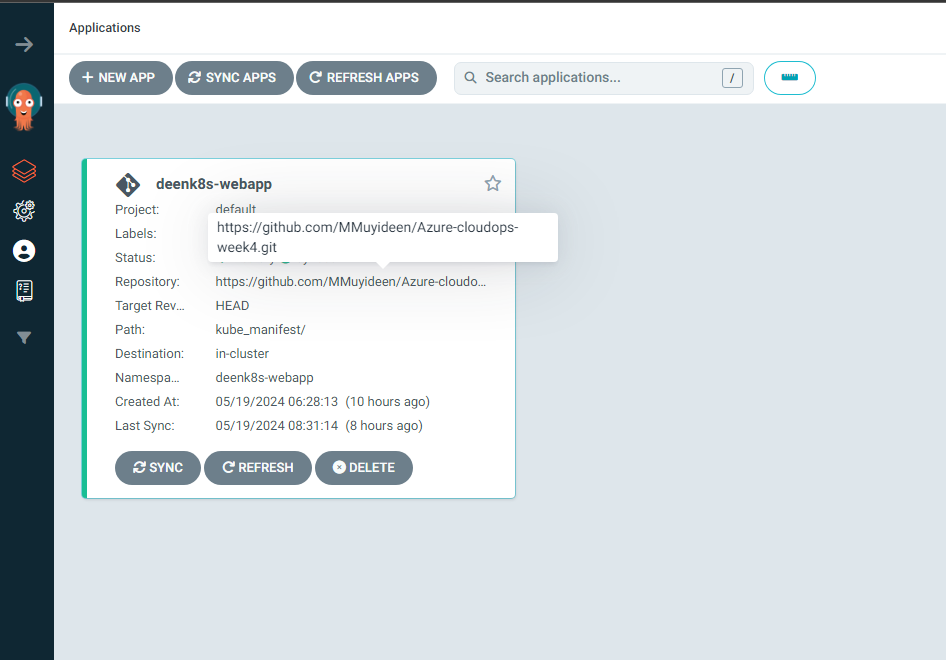

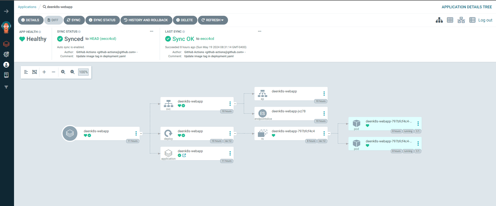

To access the application, we query the loadbalancer service running

```bash
kubectl get svc -n deenk8s-webapp
```

We copy the Loadbalancer Ip to the browser to access the app.

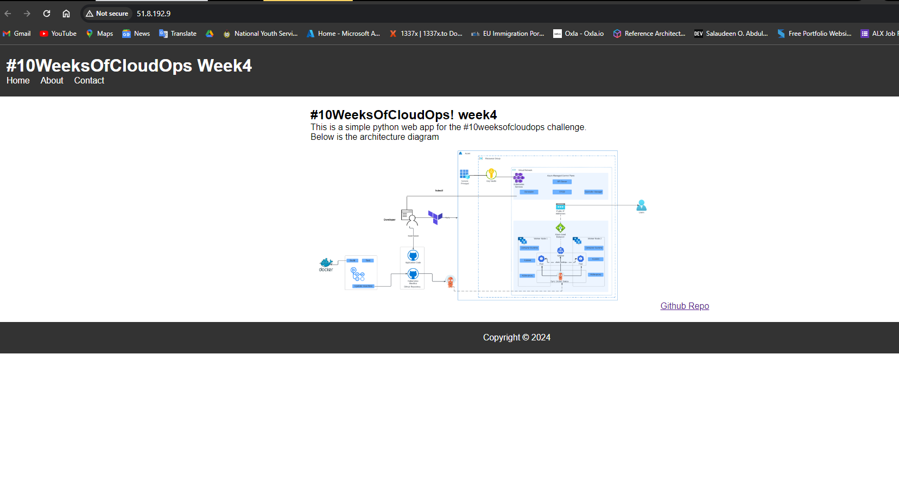

We have successfully deployed our application and able to access it

### Conclusion

This article highlights the benefits of containerization, GitOps for deploying applications and the role of orchestration in managing container lifecycles. we used Docker, Kubernetes, Terraform, and ArgoCD to create a modern and scalable application infrastructure

### CLEANUP

To cleanup we run terraform `destroy -auto-approve` command to delete the AKS resources.

We will also delete the storage account we created for the remote backend