# How to Migrate Azure API Management Instance to Stv2 Platform

If you're utilizing the [Azure API Management (APIM)](https://learn.microsoft.com/en-us/azure/api-management/api-management-key-concepts) resource on Azure, you're likely aware of the impending deprecation of the STv1 compute platform by August 31st, 2024. Microsoft has introduced a new compute platform for APIM - STv2, offering enhanced functionalities and improved capabilities for dedicated tiers. In this guide, I'll walk you through the migration process.

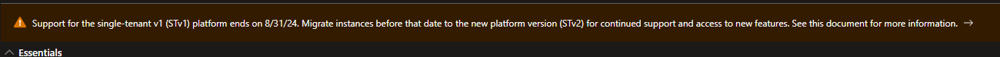

### **Understanding the Compute Platforms**

Before diving into the migration steps, let's briefly highlight the key differences between the three compute platforms:

1. **MTV:**
    
    * Available only for the consumption pricing tier.
        
    * Operates as a [serverless](https://learn.microsoft.com/en-us/azure/app-service/overview) compute platform that scales automatically.
        
2. **STV1 :**
    
    * Deprecated compute platform using the now deprecated [Azure Cloud Services (Classic).](https://learn.microsoft.com/en-us/azure/cloud-services/cloud-services-choose-me)
        
    * Set to be retired by August 31st, 2024.
        
3. **STV2 (Standard Tier Virtual Network - Version 2):**
    
    * Uses Virtual machine [scale sets](https://learn.microsoft.com/en-us/azure/virtual-machine-scale-sets/overview)
        
    * Offers enhanced functionality for dedicated tiers, including improved resiliency, Availability Zone and multi-region support (Premium Tier only), and Private Endpoints.
        

Another major difference to note is that for APIM integration with virtual network, for stv1 you do not own the Public IP address, while for the stv2 platform you are going to own the Public IPV4 address that will be used by the resource.

### **Preparing for Migration**

While there are several methods to migrate your APIM instance, for the scope of this article, I will be focusing on APIM integrated with a virtual network.

To ensure a successful migration to STv2, make sure you have the following:

* A new subnet in a virtual network in the same region and subscription as APIM
    
* An NSG attached to the subnet with [specific set of rules](https://learn.microsoft.com/en-us/azure/api-management/api-management-using-with-vnet?tabs=stv2#configure-nsg-rules) that meets all of the requirements of APIM integration with virtual network.
    
* A Standard Sku IPv4 address with DNS name label attached also in the same region and subscription as APIM and Virtual network
    
* Additional IPv4 address if you plan to reuse the old subnet
    

N.B The APIM instance service IP address will change so might want to update the DNS settings if you are using custom DNS or update the IP whitelisting.

### **Migration Steps**

Here is my APIM instance in stv1 which I will be using for the demo.

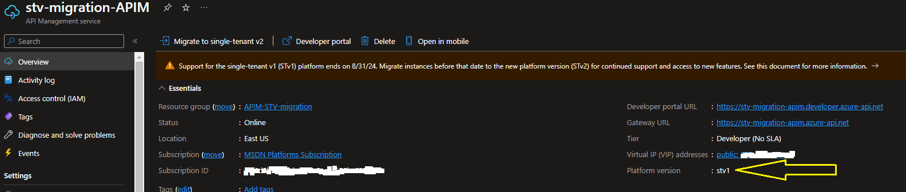

**Prepare Network Environment**

Below is the virtual network and subnets I am using. stv1 subnet is where the APIM Instance is currently is and I will be using the stv2 subnet for the migration.

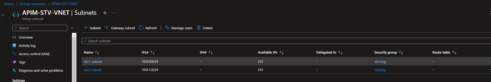

Configure the NSG rules as specified in the [APIM documentation](https://learn.microsoft.com/en-us/azure/api-management/api-management-using-with-vnet?tabs=stv2#configure-nsg-rules).

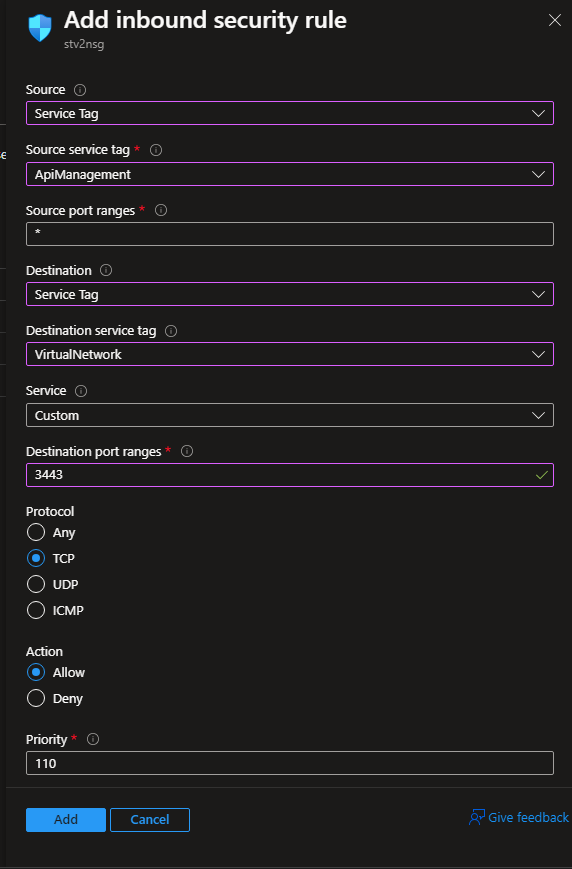

Your NSG rules should look similar to the below after configuration.

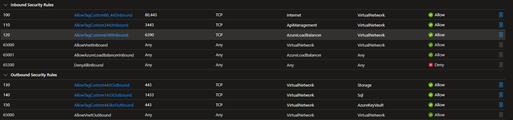

**Create the Public IP address as follows.**

Take note of the dns name label (must be unique and dns compliant)

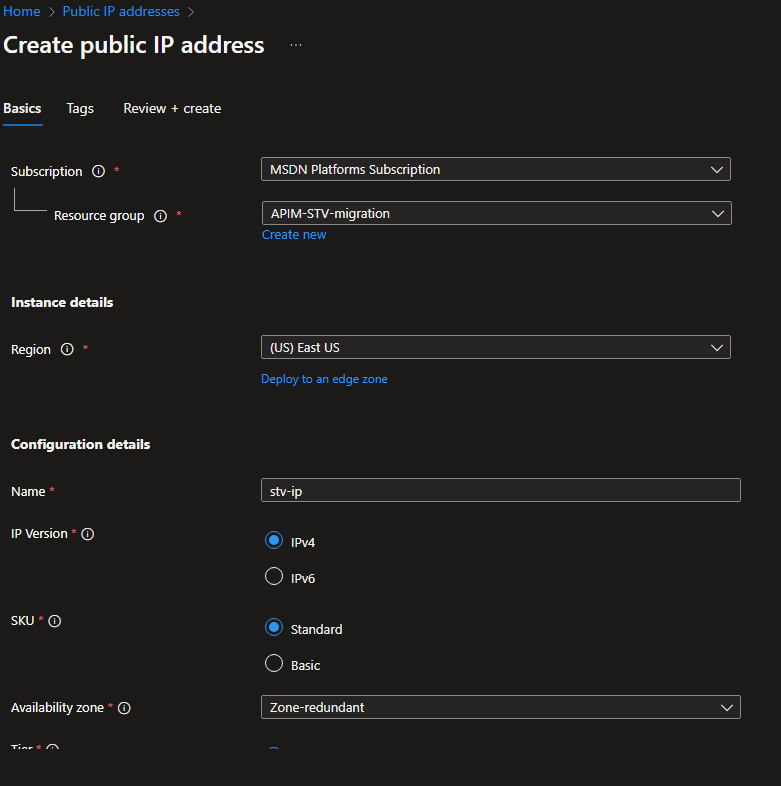

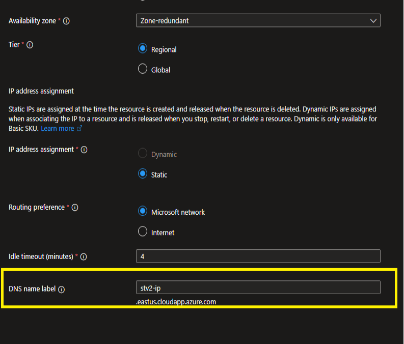

### **Initiate Migration**

After this we are ready for the migration itself. kindly follow the following steps.

1. On the APIM resource, navigate to the Network tab on the left pane
    
2. Click on the location of the Network
    
3. Confirm the virtual network, the new subnet and the public IP address (you will not see the Ip address if the dns name is not present)
    
4. Click on Apply below the page
    
    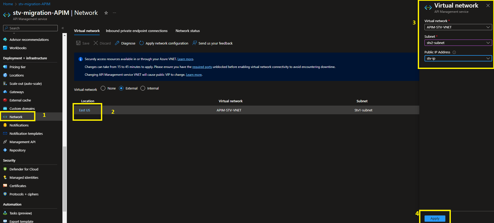
    
5. Finally click on the save button above the page
    
    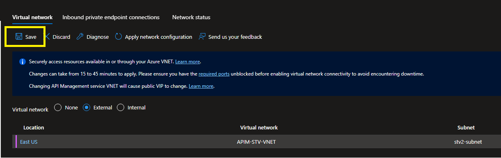
    

### **Finalizing Migration**

The migration process will start, and your APIM instance will transition to the updating state. Expect the update to take between 15 to 45 minutes, with no downtime except for Developer Sku.

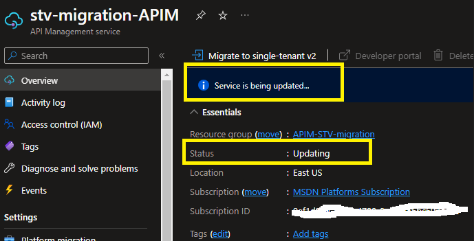

By following these steps, you can ensure a smooth migration from STv1 to STv2.

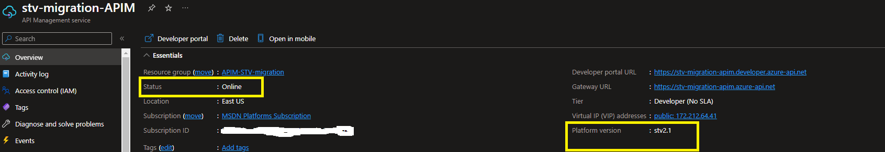

### Migrating Back to old Subnet

If you would like to migrate back to the original subnet, follow the same steps of changing the APIM subnet only this time you will need a different Ip address for the migration.

Note that it might take several hours for the old subnet to be reusable again.

### Conclusion

Finally if you are still experiencing issues during Migration, it is most likely due to networking configuration. ensure the subnet meets all of APIM [required dependencies](https://learn.microsoft.com/en-us/azure/api-management/api-management-using-with-vnet?tabs=stv2#prerequisites) especially if are [Force tunnelling](https://learn.microsoft.com/en-us/azure/api-management/api-management-using-with-internal-vnet?tabs=stv2#force-tunnel-traffic-to-on-premises-firewall-using-expressroute-or-network-virtual-appliance) traffic on the network.

Ensure you review your configuration properly, then raise a ticket to Azure Support.
