Hello There, I am participating in [10 weeks of CloudOps Challenge](https://github.com/piyushsachdeva/10weeksofcloudops/blob/main/README.md) by [Piyush Sachdeva](https://www.linkedin.com/in/piyush-sachdeva/) and I am excited to share my journey through the first week's challenge with you all.

**INTRODUCTION**

Our task for this challenge was to host a static website using AWS S3, integrate AWS Cloudfront for caching, set up a custom domain, and implement CI/CD using Github Actions. I will also be using the AWS CLI for deployment.

**Architecture Overview**

Before we dive into the task, here's a quick look at the architecture we aimed to build.

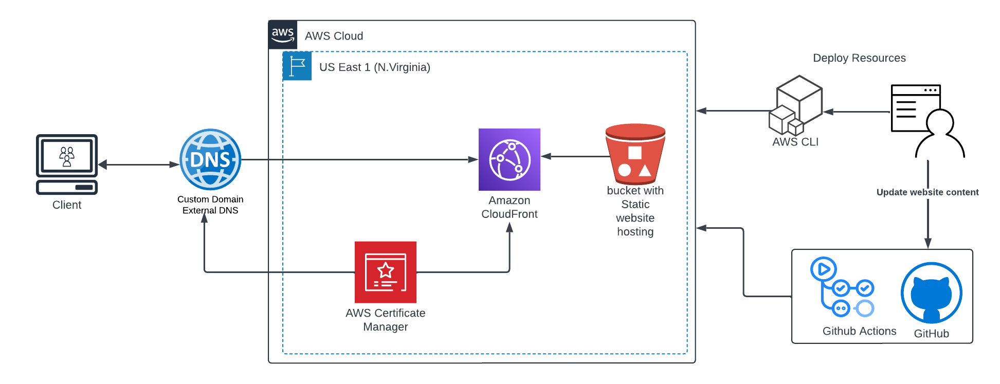

**PREREQUISITES**

* AWS Account
    
* Github account
    
* VSCode
    
* Custom Domain (optional)
    

### **Setup**

To kick things off, we need to set up our project on GitHub by creating a new repository or forking an existing one [here](https://github.com/MMuyideen/Aws-cloudops-week1). Next, we'll clone the repository to VSCode as our local workspace.

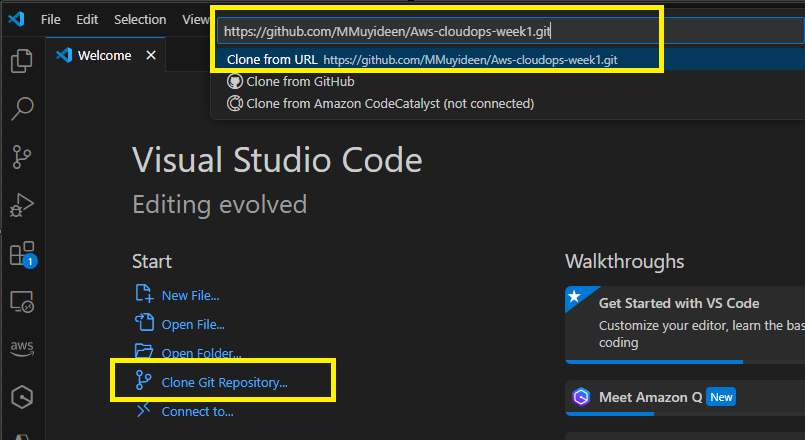

Then, we'll go through the [`starter-script.sh`](http://starter-script.sh) file, making necessary changes. This script handles the creation of S3 bucket, uploading files, enabling website hosting, ensuring public access, and setting up policies. It also takes care of creating the ACM certificate and CloudFront distribution.

Next is to install AWS CLI if not already ([Link to install](https://docs.aws.amazon.com/cli/latest/userguide/getting-started-install.html)) installed and login by inputting the command `aws configure` and we get a prompt to enter credentials.

To get the credentials, we navigate to the IAM dashboard on AWS Console. click on the user we want to use and click security credentials. create Access key and copy the values and store them as we will need them later. input the values appropriately in the CLI and enter the default region.

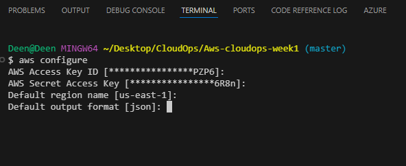

### DEPLOYMENT

After authenticating successfully to AWS, we can now deploy the script by running the command `./starter-script.sh` in the bash terminal.

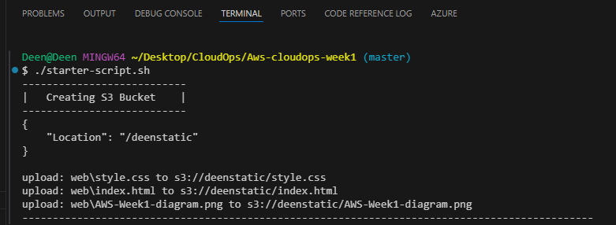

After creating the certificate, we need to validate domain ownership. The script will display some values which we need to create CNAME records. The values are also sent to a file `validation data.txt`

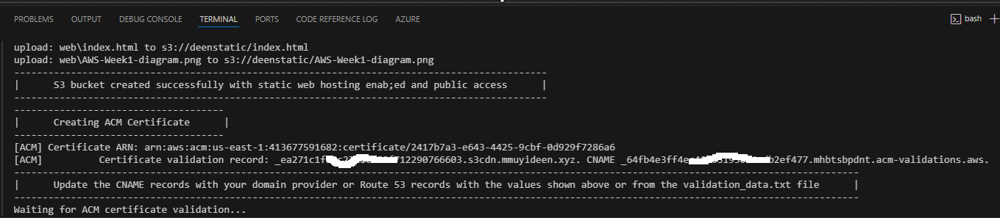

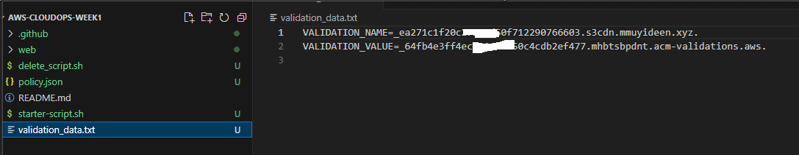

* Domain Name = the fqdn we want to use for our website
    
* Record name = VALIDATION\_NAME
    
* Record type = CNAME
    
* Record value = VALIDATION\_VALUE
    

After some time the records are validated and the script will deploy the remaining resources and we can see them on the AWS console.

### CONFIGURATION

We can now access the website from the s3 web endpoint. the url can be gotten from the properties tab on the s3 bucket page in the AWS console.

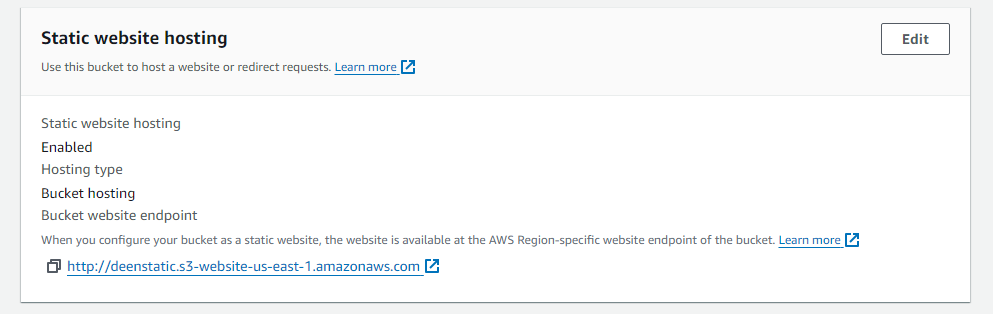


as well as the cloudfront cdn endpoint.

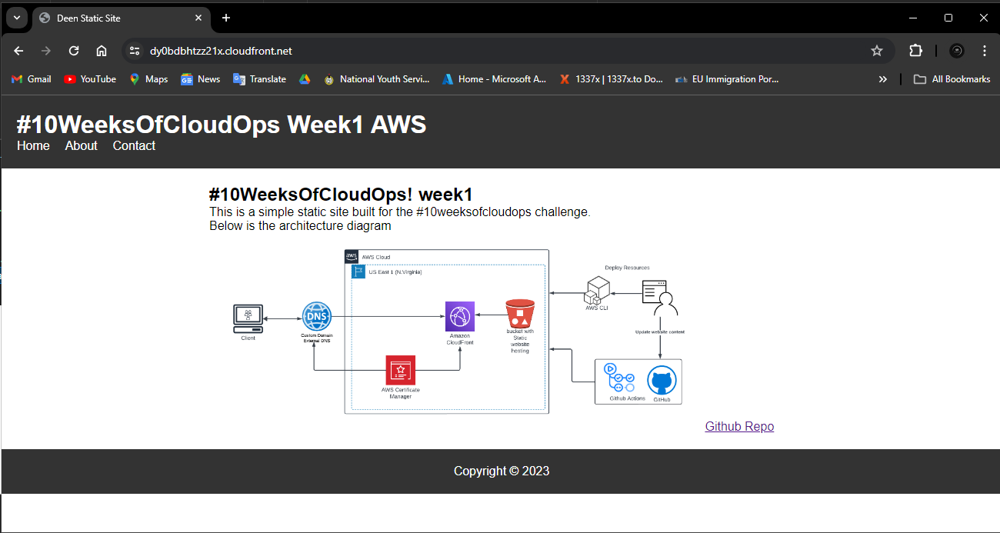

Next is to associate our custom domain with cloud front. On the AWS console, navigate to the Cloudfront page and click on the distribution.

on the General page click on edit in the settings pane

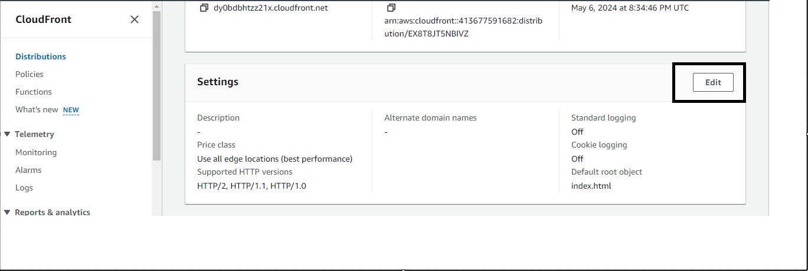

Click on Add under the Alternate domain and enter the custom domain fqdn and select the certificate we created the dropdown below for custom SSL certificate

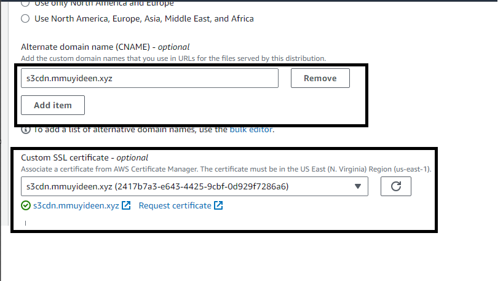

click save changes at the bottom of the page.

Finally we create a CNAME record pointing to the cloudfront url on our Domain records. Then we can access our website from the custom domain url.

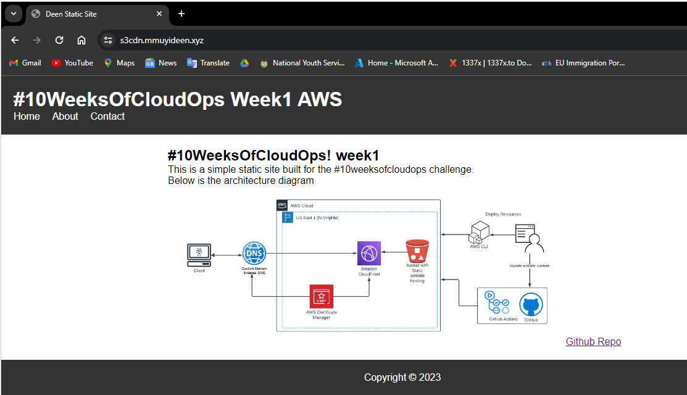

### CICD

Now, let's set up CI/CD using GitHub Actions. We'll write a script that automatically updates the website content and invalidates the CloudFront cache upon pushing changes from our local environment to GitHub.

To enable GitHub to authenticate with our AWS account, we'll configure AWS credentials in the repository settings as secrets.

1. Navigate to the repository page on github and click project settings on the top pane.
    
2. On the left pane, click on Secrets and variables
    
3. Click on new repository secret.
    
4. For the name put AWS\_ACCESS\_KEY\_ID and for the secret put the access key id we copied earlier.
    
5. Repeat for the secret access key using AWS\_SECRET\_ACCESS\_KEY as name
    

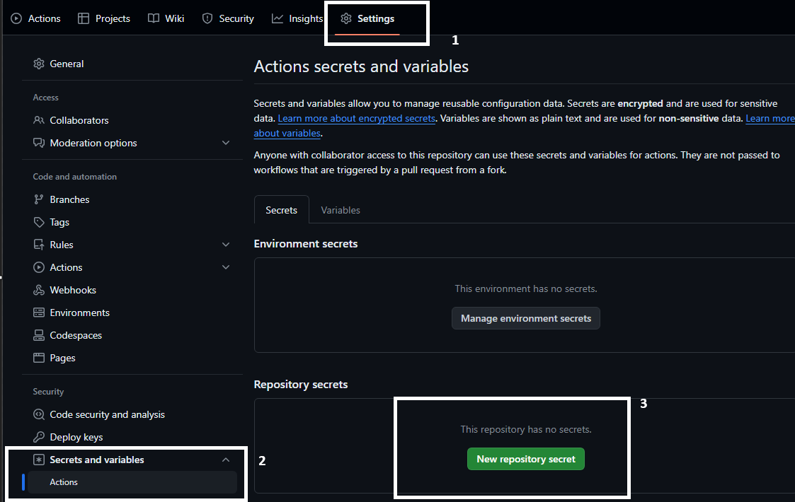

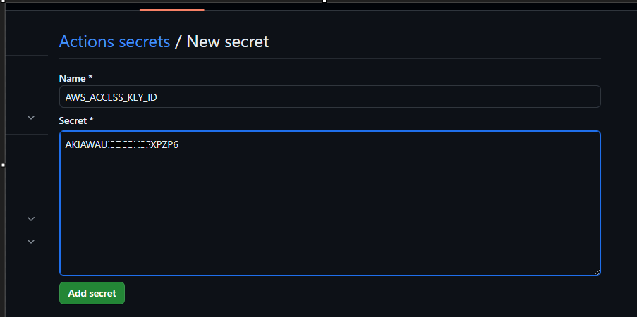

Next, we create a folder in the workspace named .`github` and another folder inside named `workflows`.

we create a file named `main.yaml` or `main.yml`.

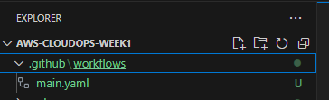

```yaml
name: Build and Deploy

on:
  push:
    branches: 
      - master

jobs:
  deploy:
    runs-on: ubuntu-latest

    steps:
      - name: Checkout
        uses: actions/checkout@v2

      - name: Configure AWS credentials
        uses: aws-actions/configure-aws-credentials@v1
        with:
          aws-access-key-id: ${{secrets.AWS_ACCESS_KEY_ID}}
          aws-secret-access-key: ${{secrets.AWS_SECRET_ACCESS_KEY}}
          aws-region: us-east-1

      - name: Deploy updated static content to s3
        run: aws s3 cp web/ s3://deenstatic/ --recursive

      - name: Invalidate cloudfront cache
        run: aws cloudfront create-invalidation --distribution-id d1v1glwzy38oz4 --paths "/*"
```

To create the invalidation, we need the Cloudfront distribution id, run the below command to get the id.

```bash
CLOUDFRONT_DIST_ID="$(aws cloudfront list-distributions \
  --query "DistributionList.Items[*].Id" \
  --output text)"

echo $CLOUDFRONT_DIST_ID
```

Use the id to update the yaml file. do not forget to change the Bucket name as well.

To test the changes, we will make some changes to our web content and we push to github by running the below commands

```bash
git add .
git commit -m "update website"
git push
```

on the Github page, click on Actions and we can see our pipeline deploy successfully.

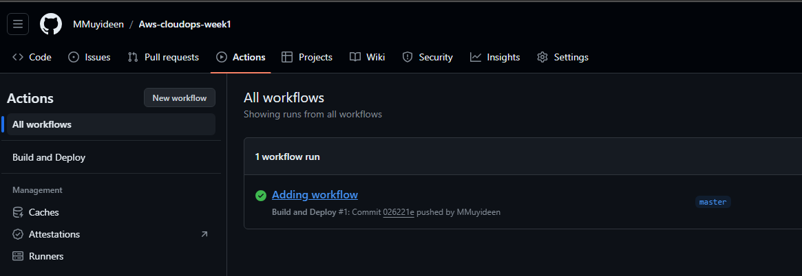

we can also dig in to see how github runs the workflow.

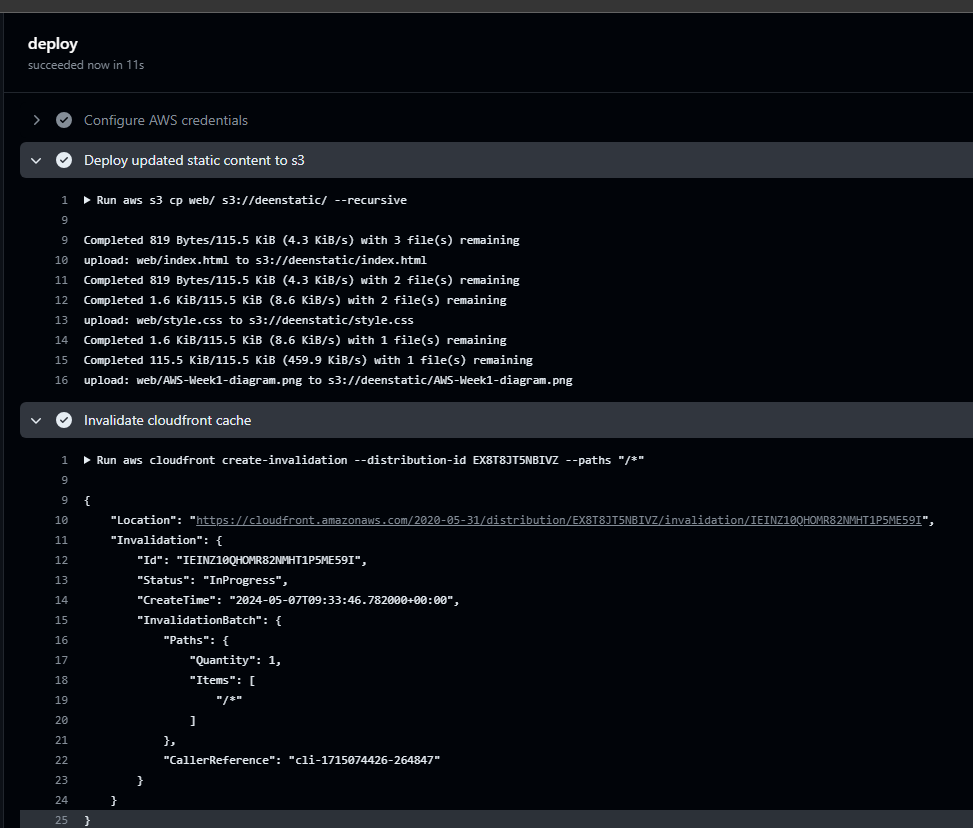

we can see that the changes is visible on our website.

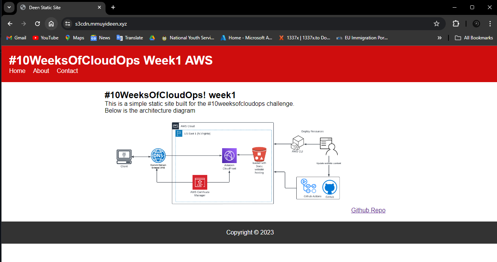

### CLEANUP

Finally, we clean up the resources to avoid incurring cost.

1. Empty the bucket and delete the bucket
    
2. Disable cloudfront distribution
    
3. Delete the cloudfront distribution
    
4. Delete the certificate.
    
