Hello There, I am participating in [10 weeks of CloudOps Challenge](https://github.com/piyushsachdeva/10weeksofcloudops/blob/main/README.md) by [Piyush Sachdeva](https://www.linkedin.com/in/piyush-sachdeva/) and I am excited to share my journey through the AWS second week's challenge with you all.

The task for this week's challenge was to Design and implement secure, scalable and highly-available three tier web application in AWS. To add a personal flavour to this project, I decided to deploy all the resources using CLI except for a few manual steps.

**Architecture Overview**

Before we delve into the challenges and solutions, here's a quick look at the architecture we aimed to build.

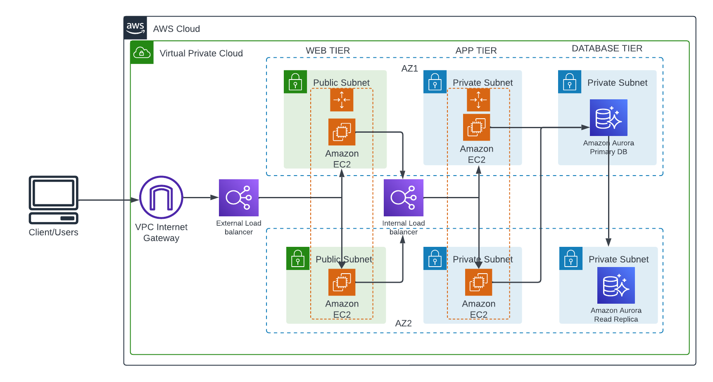

In [this](https://catalog.us-east-1.prod.workshops.aws/workshops/85cd2bb2-7f79-4e96-bdee-8078e469752a/en-US/introduction) architecture, a public-facing Application Load Balancer forwards client traffic to our web tier EC2 instances. The web tier is running Nginx webservers that are configured to serve a React.js website and redirects our API calls to the application tier’s internal facing load balancer. The internal facing load balancer then forwards that traffic to the application tier, which is written in Node.js. The application tier manipulates data in an Aurora MySQL multi-AZ database and returns it to our web tier. Load balancing, health checks and autoscaling groups are created at each layer to maintain the availability of this architecture.

### Environment Setup

First thing we need to clone the code locally or fork the repository before cloning.

`git clone`[`https://github.com/aws-samples/aws-three-tier-web-architecture-workshop.git`](https://github.com/aws-samples/aws-three-tier-web-architecture-workshop.git)

Then we create an s3 bucket and upload the code later.

```bash
# Create S3 bucket
aws s3api create-bucket \
  --bucket $S3_BUCKET_NAME \
  --region us-east-1
```

Next thing we need to do is to create an ec2 instance role and assign the `AmazonSSMManagedInstanceCore` and `AmazonS3ReadOnlyAccess` permissions to enable the ec2 instances reach the s3 bucket to copy the code and access the session manager so we can connect to the instances securely.

* On the AWS console page, go to IAM and click Roles then create.
    
* 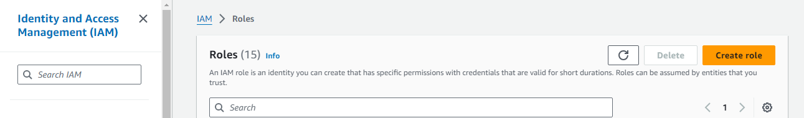
    
* Select AWS service for Trusted entity type and 'ec2' as Use case
    
* 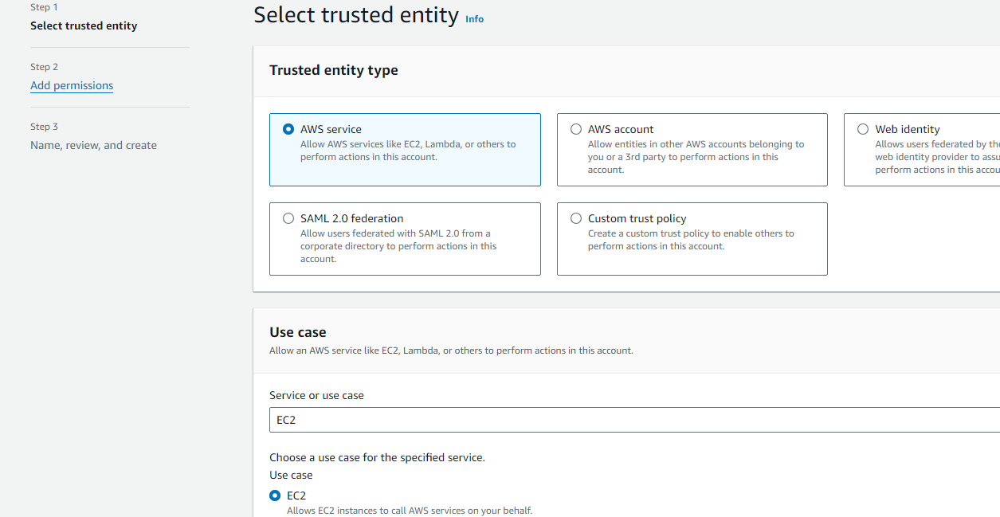
    
    Search for `AmazonSSMManagedInstanceCore` and `AmazonS3ReadOnlyAccess` permissions and select. click next.
    
* 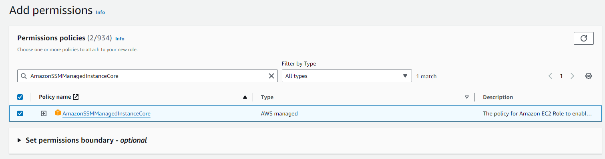
    
    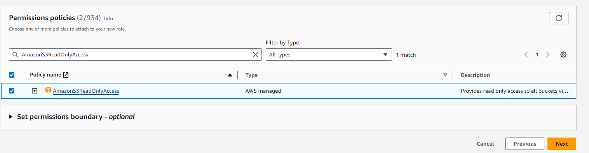
    
    name the role and click create.
    

### Resources Deployment

The script i used to deploy the resources is in two parts. [Here](https://github.com/MMuyideen/AWS-CloudOps-week2/blob/master/starter-script.sh) is the first part.

It will deploy the following resources.

* VPC
    
* Subnets
    
* Internet Gateway
    
* Elastic IPs
    
* NAT Gateways
    
* Route Tables and routes
    
* Security Groups and rules
    
* DB Subnet Group
    
* DB cluster and DB instances (writer and reader)
    
* EC2 Instances for both App tier and web tier (to build image)
    

After the resources are deployed, we need to configure the instance to run the applications and we use it to build the image for the Auto scaling groups.

but first we get the details of the database and update the DBConfig.js file in the app-tier folder before uploading to s3.

copy the Aurora RDS instance endpoint url and paste in DB\_HOST in the file.

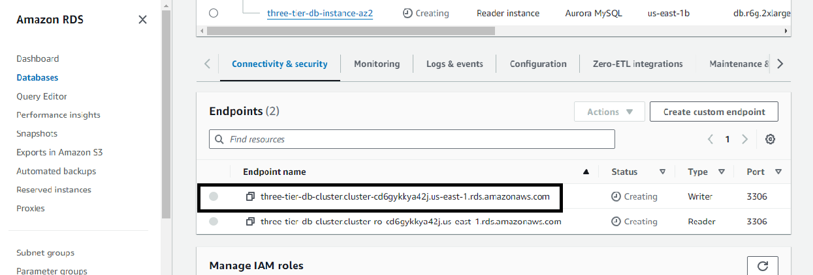

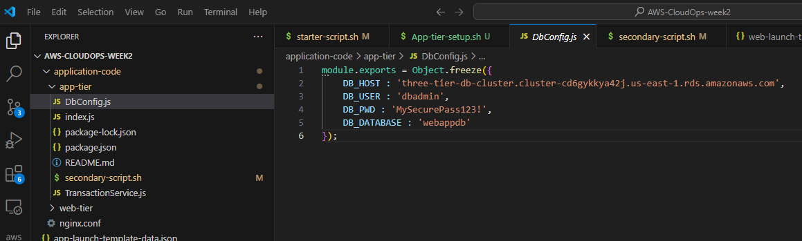

**INSTANCE SETUP**

we connect to the App instance securely using Session manager and setup the configuration using these commands.

```bash
#!/bin/bash

# make sure to edit the placeholders
sudo -su ec2-user
sudo yum install mysql -y
mysql -h CHANGE-TO-YOUR-RDS-ENDPOINT -u CHANGE-TO-USER-NAME -p
CREATE DATABASE webappdb;   
SHOW DATABASES;
USE webappdb;    
CREATE TABLE IF NOT EXISTS transactions(id INT NOT NULL
AUTO_INCREMENT, amount DECIMAL(10,2), description
VARCHAR(100), PRIMARY KEY(id));    
SHOW TABLES;    
INSERT INTO transactions (amount,description) VALUES ('400','groceries');   
SELECT * FROM transactions;
exit

curl -o- https://raw.githubusercontent.com/nvm-sh/nvm/v0.38.0/install.sh | bash
source ~/.bashrc
nvm install 16
nvm use 16
npm install -g pm2   
cd ~/
aws s3 cp s3://BUCKET_NAME/app-tier/ app-tier --recursive
cd ~/app-tier
npm install
pm2 start index.js
pm2 list
pm2 logs
pm2 startup

# copy the output of the above command an

pm2 save

# Test App 
curl http://localhost:4000/health  # expected response is "This is the health check"

curl http://localhost:4000/transaction # expected response {"result":[{"id":1,"amount":400,"description":"groceries"},{"id":2,"amount":100,"description":"class"},{"id":3,"amount":200,"description":"other groceries"},{"id":4,"amount":10,"description":"brownies"}]}

# app successfully setup
```

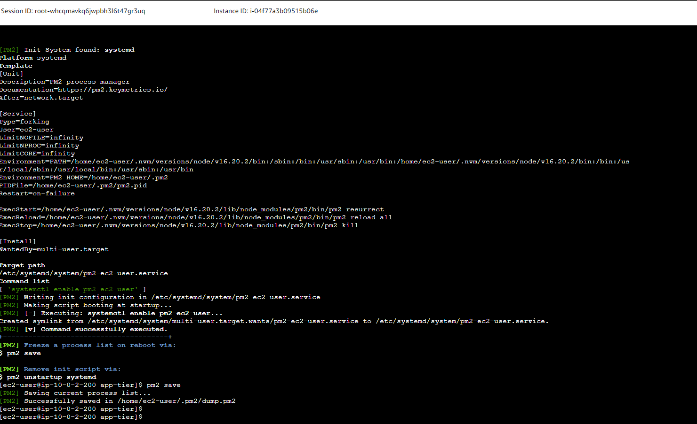

Next step is to create an image from the App tier instance, create Target group, ALB, Listener, Launch template and Auto scaling group. This is contained in the [secondary-script](https://github.com/MMuyideen/AWS-CloudOps-week2/blob/master/secondary-script.sh) of my repo. which I recommend to be deployed by copying the script manually into the cli.

**WEB Instance setup**

Before setting up the web tier, we get the app tier load balancer DNS name and update the code in the web-tier. Paste the DNS in the `nginx.conf` file.

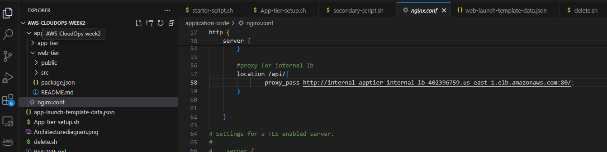

we upload the files by running the s3 command again on manually on the console.

Then like we did for App tier image, we connect to the web tier instance securely and configure the application.

```bash
#!/bin/bash

# make sure to edit the placeholders values
sudo -su ec2-user

curl -o- https://raw.githubusercontent.com/nvm-sh/nvm/v0.38.0/install.sh | bash
source ~/.bashrc
nvm install 16
nvm use 16

cd ~/
aws s3 cp s3://BUCKET_NAME/web-tier/ web-tier --recursive # use the correct s3 bucket name

cd ~/web-tier
npm install 
npm run build

sudo amazon-linux-extras install nginx1 -y
cd /etc/nginx
ls

sudo rm nginx.conf
sudo aws s3 cp s3://BUCKET_NAME/nginx.conf .

sudo service nginx restart

chmod -R 755 /home/ec2-user # To make sure Nginx has permission to access our files

sudo chkconfig nginx on # to make sure the service starts on boot
```

Then we should be able to access our Application from the we tier IP address

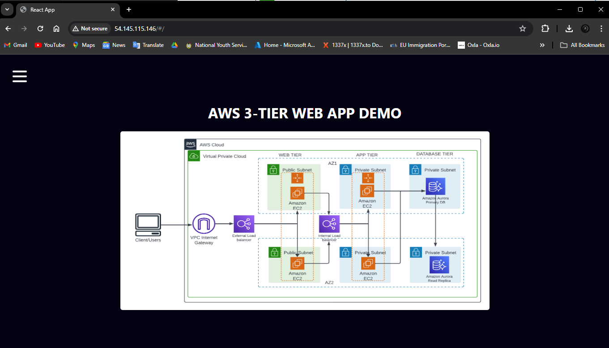

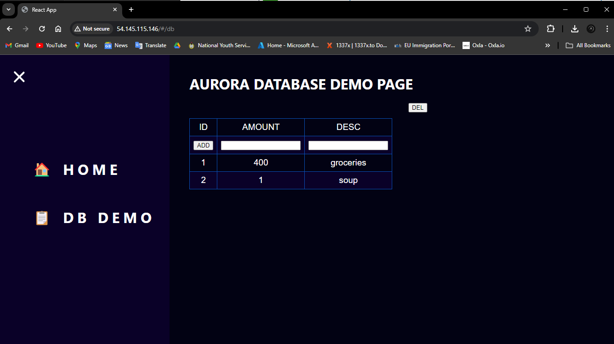

Finally we run the rest of the command in the secondary script to create an image from the web tier instance, create Target group, ALB, Listener, Launch template and Auto scaling group.

Finally we can access the application from the load balancer DNS

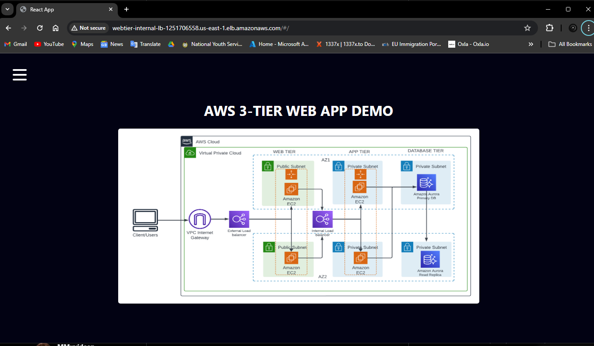

### CLEANUP

Finally after verifying the configuration we cleanup the resources by deploying the [delete script](https://github.com/MMuyideen/AWS-CloudOps-week2/blob/master/delete.sh).

Thank you for reading. You can check out my other articles [here](https://blog.mmuyideen.xyz/) or connect with me on [Linkedin](https://www.linkedin.com/in/muyideenmorenigbade/)