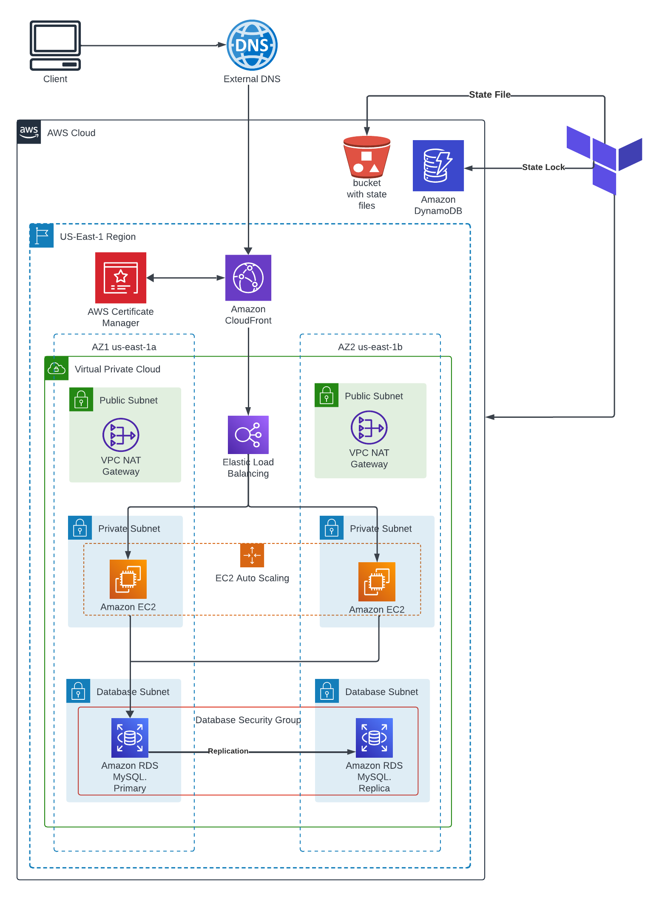

Hello There, I am participating in [10 weeks of CloudOps Challenge](https://github.com/piyushsachdeva/10weeksofcloudops/blob/main/README.md) by [Piyush Sachdeva](https://www.linkedin.com/in/piyush-sachdeva/) and I am excited to share my journey through the third week's challenge with you all.

**INTRODUCTION**

Our task for this challenge was to deploy a two tier web Application to AWS using Terraform. The challenge aim to

*   Leverage Custom Modules
    
*   Use Variables and Data Sources
    
*   Remote State File
    
*   Security First
    

**Architecture Overview**

Before we dive into the task, here's a quick look at the architecture we aimed to build.

In this architecture, we deployed instances in a private subnet and Database with multi AZ replication also in Private subnets. The instances are launched from Auto scaling group with a Layer 7 load balancer in front. We also deployed CloudFront for caching with ACM certificate to connect over HTTPS with the custom domain.

### Environment Setup