Hey Everyone.

I want to share how I was able to complete the Azure cloud resume challenge in 2024. I encountered some issues while doing mine as the [original video](https://www.youtube.com/watch?v=ieYrBWmkfno&t=1774s) was done using dotnet 3 which is no longer available on Visual Studio Code.

Coming from a non-development experience, I had to do lots of research to be able replicate the code in dotnet 6 as well as improved UI in the other technologies.

I will try and make this article as short and explanatory enough for anyone to follow.

### Prerequisites

* Visual Studio Code with necessary extensions.
    
* Azure account with subscription (can also be free tier)
    
* Github account
    

### Technologies used

* Azure Storage for static website hosting (Html, CSS)
    
* Azure Cosmos DB for counter storage
    
* Azure Functions for counter incrementation
    
* Azure CDN for efficient content caching
    
* GitHub Actions for seamless CI/CD
    

## Steps

1. Start by cloning the original repository from A cloud Guru [here](https://github.com/ACloudGuru-Resources/acg-project-azure-resume-starter). The frontend folder will contain the static content (html and css), while the backend will contain the function code.
    
2. Open and inspect the `index.html` in the frontend folder both in VSCode for editing and browser for visualizing. Make changes accordingly with your details. open the images folder and use your desired image as the `me.png` image.
    
    Take note of the code on line 59 which is where the function will be called.
    
    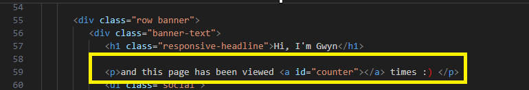
    
3. **Deploy to Azure Storage**
    
    install the Azure tools extension in vscode
    
4. 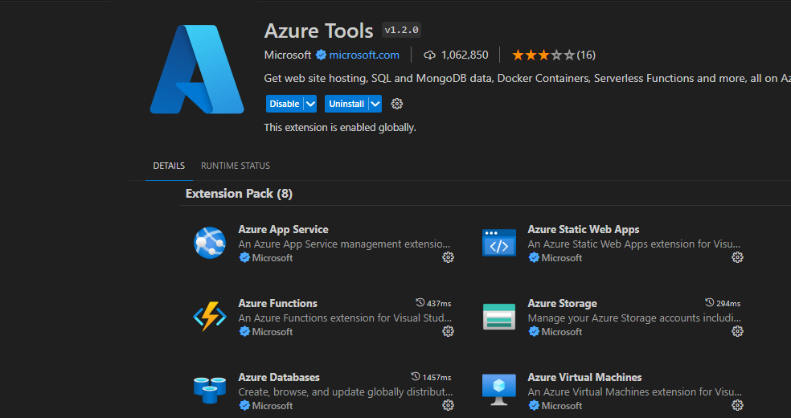
    
5. From the vscode explorer on the left pane, right click on the frontend folder and click deploy to static website via Azure storage. follow the prompts to deploy the website to Azure.You can either be prompted to create a new storage account if you do not have any or choose an existing one. Choose `index.html` as the default page. follow the rest of the prompt and enable static website hosting.
    

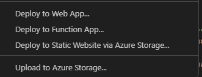

**Navigating to the website.**

Navigate to the storage account on Azure Portal and on the left pane, under data management, choose static website. copy the primary endpoint and paste in a new browser tab.

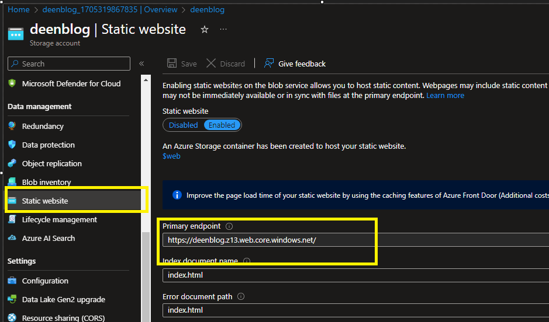

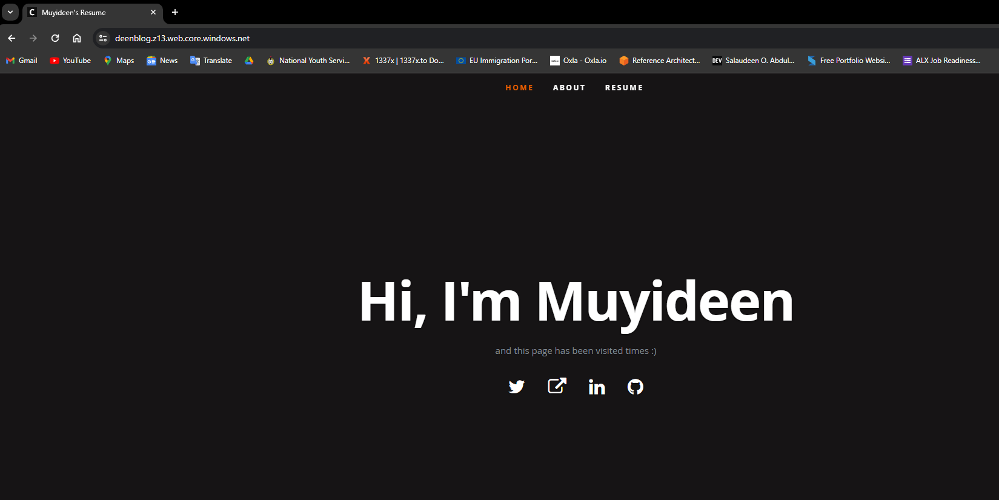

### CREATING THE DATABASE

* **Creating the Cosmos DB account**
    
    On Azure Portal search for Cosmos DB and choose Azure Cosmos DB for NoSQL. choose the correct subscription and Resource Group, for capacity mode choose serverless, Review and create then create. wait for the deployment.
    
    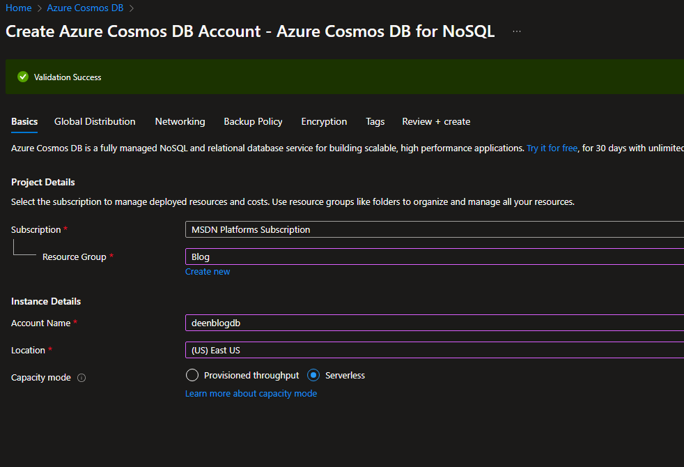
    
    After the deployment completes,
    
* click on data explorer on the left pane of the cosmos db page.
    
* click new container and fill as follows. click okay.
    
    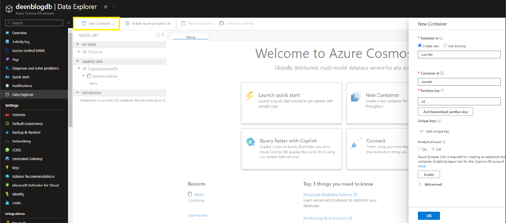
    
    click on the new container and items from the drop down.
    
* click New item, clear the default json with the below.
    
* click on save
    
* ```json
    {
        "id": "1",
        "count": 0
    }
    ```
    
* 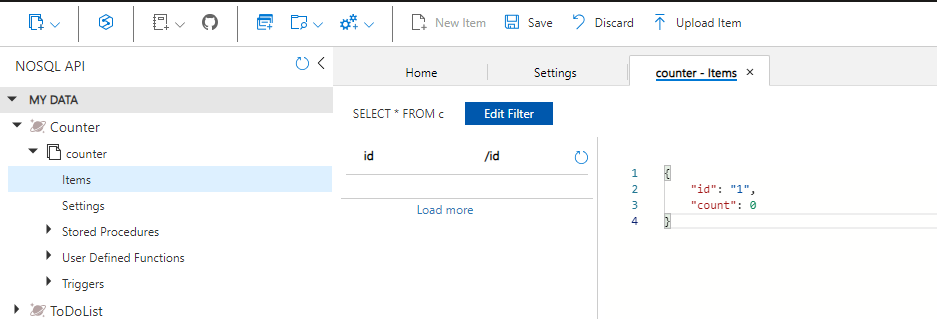
    
    After saving it, the json will be populated with additional data.
    

Creating the Function.

navigate back to vscode and click the Azure Tools Extension

From the workspace section click on the Azure function icon and select create a new project.

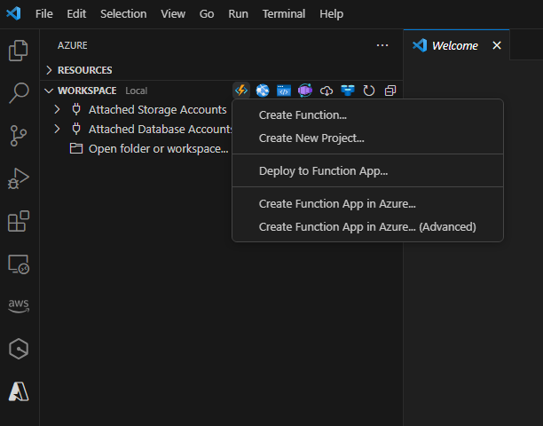

save the project in the api folder in the backend folder.

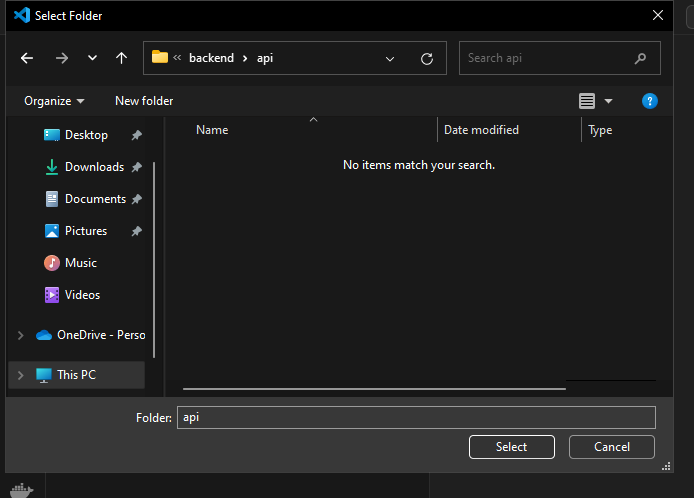

language choose c# Runtime choose .NET runtime .NET 6.0 LTS template http trigger function name can be something like 'resumecounter' or 'getcounter' leave namespace as Company.Function AccessRights Function

replace the code in the resumecounter.cs file with the below. ensure to use your own database name.

```csharp
using System;
using System.IO;
using System.Threading.Tasks;
using Microsoft.AspNetCore.Mvc;
using Microsoft.Azure.WebJobs;
using Microsoft.Azure.WebJobs.Extensions.Http;
using Microsoft.AspNetCore.Http;
using Microsoft.Extensions.Logging;
using Newtonsoft.Json;
using System.Net.Http;
using System.Collections.Concurrent;
using System.Text;
using System.Threading;


namespace Company.Function
{
    public static class GetResumeCounter
    {
        [FunctionName("getresumecounter")]
        public static HttpResponseMessage Run(
            [HttpTrigger(AuthorizationLevel.Function, "get", "post", Route = null)] HttpRequest req,
            [CosmosDB(databaseName:"deenblogdb", containerName: "Counter", Connection = "connectionstring", Id = "1", PartitionKey = "1")] Counter counter, 
            [CosmosDB(databaseName:"deenblogdb", containerName: "Counter", Connection = "connectionstring", Id = "1", PartitionKey = "1")] out Counter updatedCounter,
            ILogger log)
        {
            // here is Where the the counter gets updated
            log.LogInformation("C# HTTP trigger function processed a request.");

            counter ??= new Counter();

            updatedCounter = counter;
            updatedCounter.Count += 1;

            var jsonToReturn = JsonConvert.SerializeObject(counter);


            return new HttpResponseMessage(System.Net.HttpStatusCode.OK)
            {
                Content = new StringContent(jsonToReturn, Encoding.UTF8, "application/json")
            };
        }
    }
}
```

create a new file named Counter.cs in the api folder. use the code below in the file.

```csharp
using Microsoft.Azure.Cosmos.Serialization.HybridRow.Schemas;
using Newtonsoft.Json;

namespace Company.Function
{
    public class Counter
    {
        [JsonProperty(PropertyName = "id")]
        public string ID {get; set;}
        [JsonProperty(PropertyName = "count")]
        public int Count {get;set;}
    }
}
```

Open the terminal in vs code

navigate to the api folder `cd .\backend\api\`

install the following Nuget packages

```csharp
dotnet add package Microsoft.Azure.Cosmos --version 3.37.1
dotnet add package Microsoft.Azure.WebJobs.Extensions.CosmosDB --version 4.4.2
dotnet add package Microsoft.Azure.Functions.Worker.Extensions.CosmosDB --version 4.5.1
dotnet add package Microsoft.Azure.WebJobs.Extensions.CosmosDB --version 4.4.2
dotnet add package Microsoft.Azure.WebJobs.Extensions --version 5.0.0
dotnet add package Microsoft.Azure.Functions.Worker --version 1.20.1
```

Back to the Azure extension. click on the function app icon and create function app in Azure advanced.

enter name for the function app

runtime .net 6

OS linux

choose your Resource group

choose Consumption for hosting plan and choose the previous storage account created. you can either create an Application insights or skip the step.

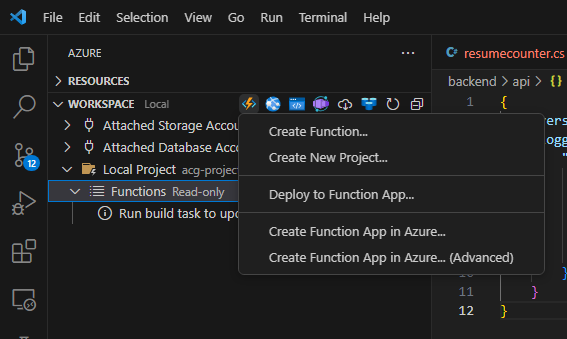

Right click on the api folder in the file explorer and click deploy to function app. choose the created function app.

on Azure portal, navigate to the cosmos db resource, on the left pane click on keys and copy the `PRIMARY CONNECTION STRING`

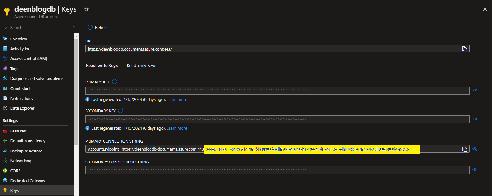

now navigate to the Azure function app and click on configuration on the left pane. click new Application setting.

in the name put `connectionstring` for the value, put the cosmosdb primary connection string and save.

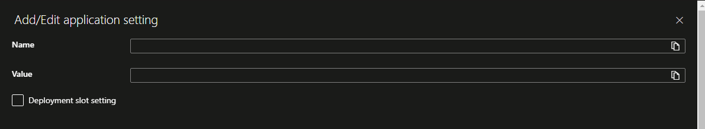

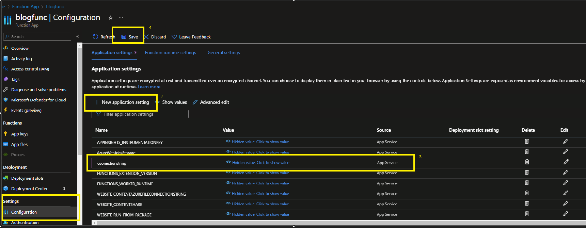