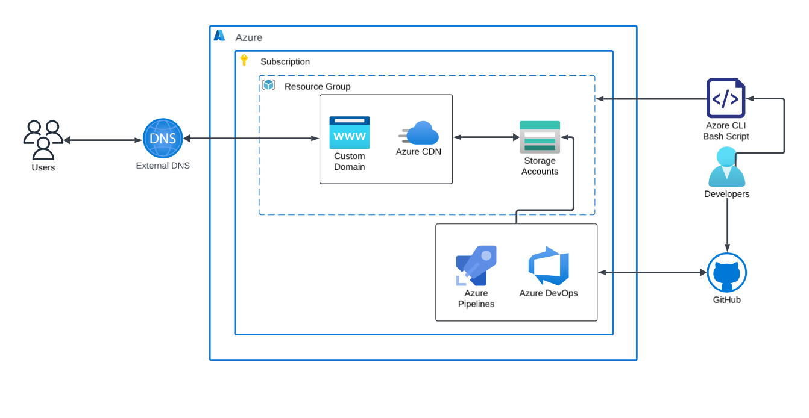
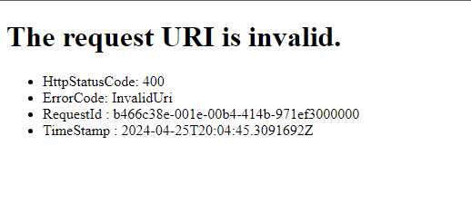
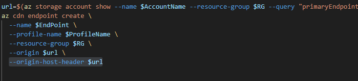
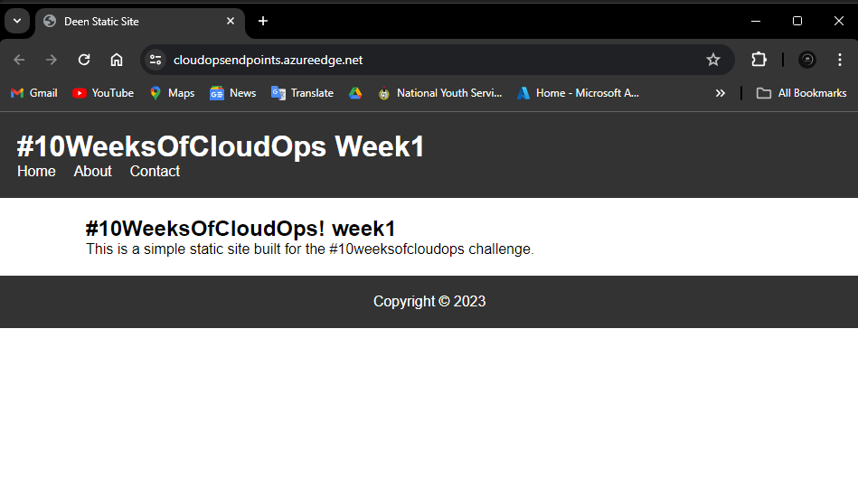
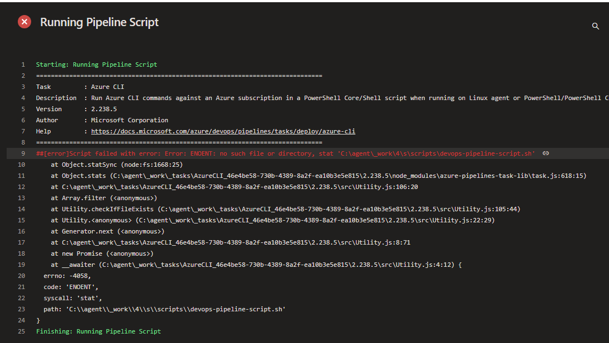
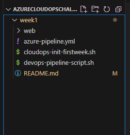
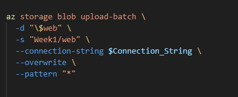
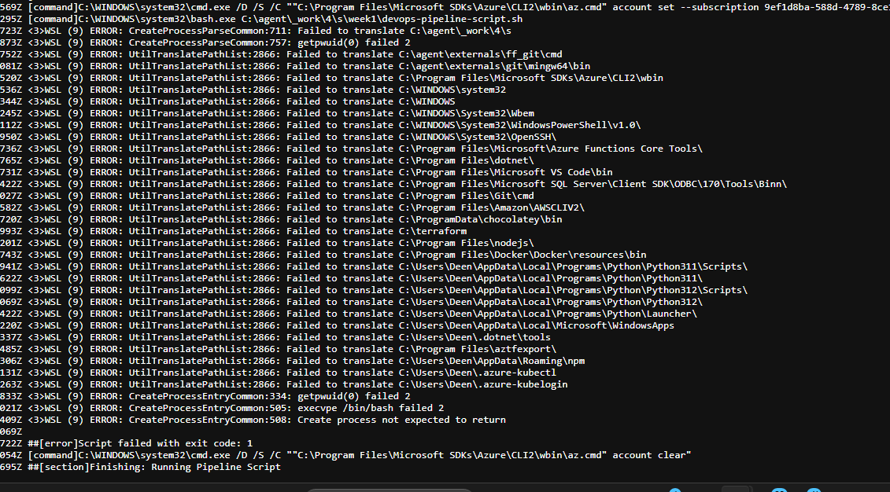
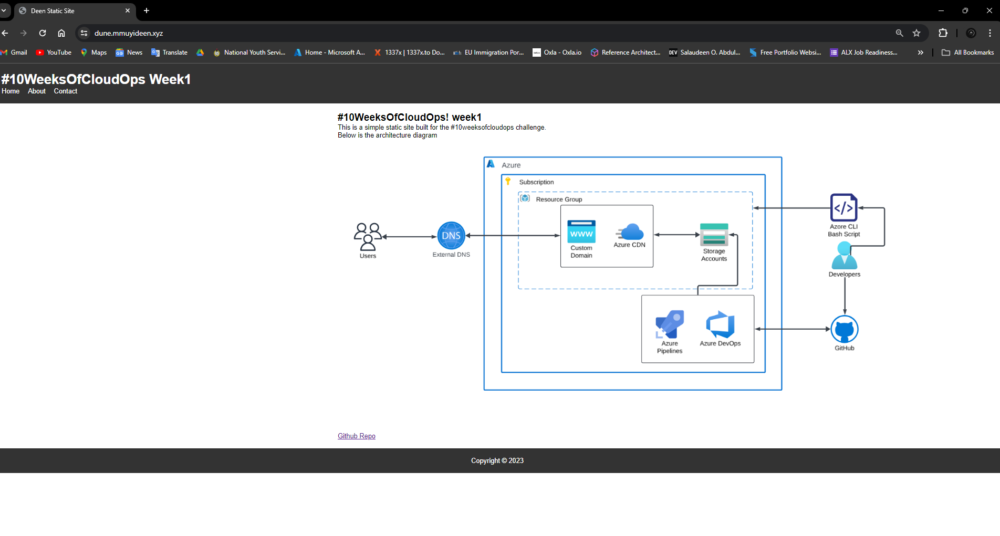

Hello There, I am participating in [10 weeks of CloudOps Challenge](https://github.com/piyushsachdeva/10weeksofcloudops/blob/main/README.md) by [Piyush Sachdeva](https://www.linkedin.com/in/piyush-sachdeva/) and I am excited to share my journey through the first week's challenge with you all.

**Static Website Hosting on Azure and implement CICD**

Our task for this challenge was to host a static website using Azure Storage, integrate Azure CDN for caching, set up a custom domain, and implement CI/CD using Azure DevOps Pipelines. Let's dive into the challenges I encountered and how I tackled them, along with some key improvements.

**Architecture Overview**

Before we delve into the challenges and solutions, here's a quick look at the architecture we aimed to build.



There is a step-by-step blog by [Nishant Singh](https://nishantsingh.hashnode.dev/10weeksofcloudops-firstweek) if you would like to do this project.

**CHALLENGE 1 : 400 error.**

After deploying the resources using a script provided by Nishant Singh, I encountered a 400 error on the CDN page.



After some investigation, I found that adding the origin host header parameter when creating the CDN, with the same value as the URL, resolved the issue. `--origin-host-header $url`





**CHALLENGE 2 : Azure DevOps Pipeline agent.**

One major hurdle was configuring the agent pools for Azure DevOps Pipeline. Initially, I attempted to use my local machine as a self-hosted agent, but it kept failing due to issues with file paths on Windows



To diagnose the problem, I used the command `echo "Current directory: $(pwd)"` and `ls -l` and was able to see were the file is expected and how to reference it properly





**CHALLENGE 3 : WSL error.**

Subsequently, I encountered errors related to Windows Subsystem for Linux (WSL).



To resolve this, I opted to create a Linux VM and updated the script with the new path, which effectively resolved the issue.

**IMPROVEMENTS 1 : Adding custom domain to script.**

I automated the creation of the custom domain for the CDN as well as enable HTTPS for the custom domain within the script. Knowing what the CDN URL will be beforehand (`$`[`endpointname.azureedge.net`](http://endpointname.azureedge.net)), I created a CNAME record in the DNS prior to deploying the script, streamlining the process.

```bash
Hostname="week1.mmuyideen.xyz"

echo "-------------------------------------"
echo "|     Creating Custom Domain        |"
echo "-------------------------------------"


az cdn custom-domain create \
  --resource-group $RG \
  --endpoint-name $EndPoint \
  --profile-name $ProfileName \
  --name "deenhost" \
  --hostname $Hostname


echo "-------------------------------------"
echo "| enable Https Custom Domain        |"
echo "-------------------------------------"


az cdn custom-domain enable-https \
  --resource-group $RG \
  --endpoint-name $EndPoint \
  --profile-name $ProfileName \
  --name "deenhost" \
  --min-tls-version 1.2

echo "-----------------------------------------------------------------------------------------------------------------------------"
echo "|     Wait for CDN to Configure Only few Mintues :) Your Setup is Almost Ready Here is Your website https://$Hostname       |"
echo "------------------------------------------------------------------------------------------------------------------------------"
```

**IMPROVEMENTS 2 : Adding Personal touch .**

Once everything was up and running smoothly, I decided to add a personal touch to the project. I included an architecture diagram to visually represent our setup and provide a clearer understanding of the infrastructure. Additionally, I shared the [GitHub](https://github.com/MMuyideen/AzureCloudopsChallenge/tree/master/Week1) repository link.



**Conclusion**

This summarizes my experience with the first week's CloudOps challenge. Stay tuned for more updates as we progress through the subsequent weeks!

Thank you for taking the time to read about my experience! If you'd like to connect further or have any questions, feel free to reach out to me on [LinkedIn](https://www.linkedin.com/in/muyideenmorenigbade/)