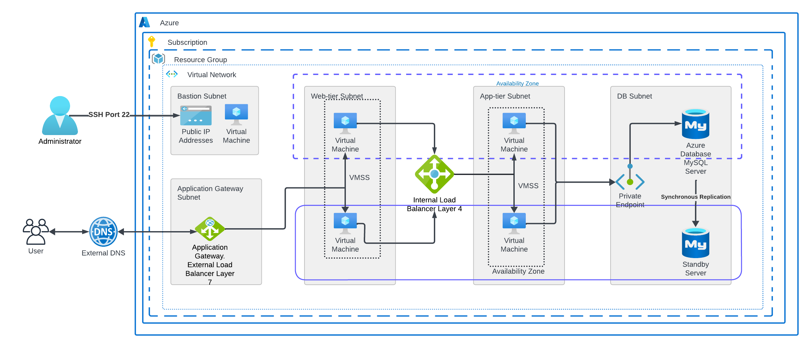
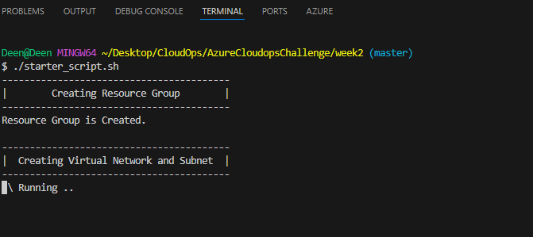

Hello There, I am participating in [10 weeks of CloudOps Challenge](https://github.com/piyushsachdeva/10weeksofcloudops/blob/main/README.md) by [Piyush Sachdeva](https://www.linkedin.com/in/piyush-sachdeva/) and I am excited to share my journey through the second week's challenge with you all.

**Deploy a three tier web application to Azure**

The task for this week's challenge was to Design and implement secure, scalable and highly-available three tier web application in Azure.

**Architecture Overview**

Before we delve into the challenges and solutions, here's a quick look at the architecture we aimed to build.

**What is Three-Tier Architecture?**  
A Three-tier architecture is a well-established software application architecture that organizes applications into three logical and physical computing tiers: the presentation tier, or user interface; the application tier, where data is processed; and the data tier, where application data is stored and managed.

1. Presentation Tier (user interface): The presentation tier is the user interface and communication layer of the application, where the end user interacts with the application. Its main purpose is to display information to and collect information from the user.
    
2. Application Tier (Data processing): The application tier processes the information that is collected in the presentation tier. The application tier can also add, delete, or modify data in the data tier. 
    
3. Data Tier (Database): The data tier is where the information that is processed by the application is stored and managed
    

Let's start building this! As before, I am using the [initial infrastructure script](https://github.com/MMuyideen/AzureCloudopsChallenge/blob/master/Week2/starter_script.sh.md) for deploying Vnet, Subnet, VMs, Application gateway, load balancer and Database.

