# How to create a Linux (Ubuntu) Virtual Machine in Azure

Creating and connecting to a Linux VM on azure portal can be tricky nevertheless, it is an easy process and only slightly different from windows VM. In this article I’ll be showing how to do just that.
You should already have an azure account and subscription. The subscription can either be your regular paid subscription, free credits for new users or student’s account.

First Step is to login to your account on the Azure portal and click on the Virtual Machine tab. you can also search for it using the search bar.

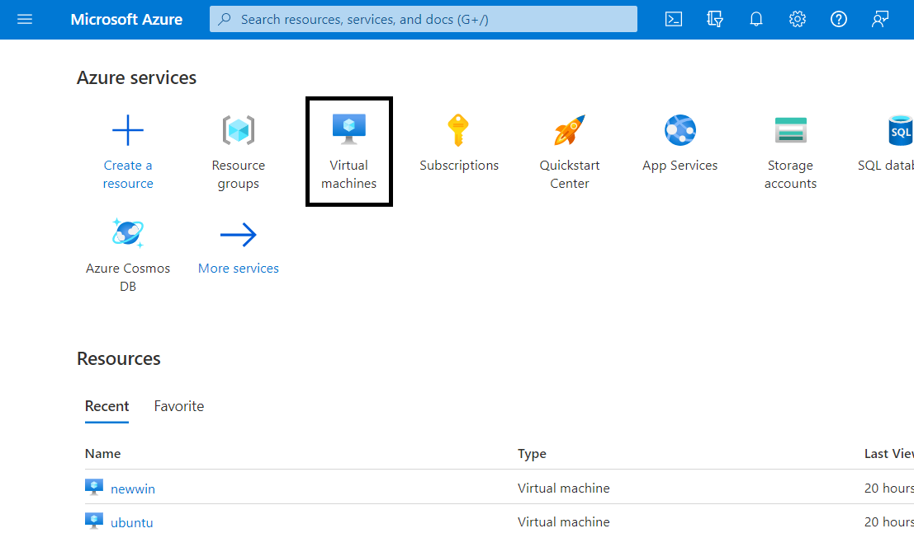

Click on the create tab at the top left in the virtual machine page and choose Azure Virtual Machine

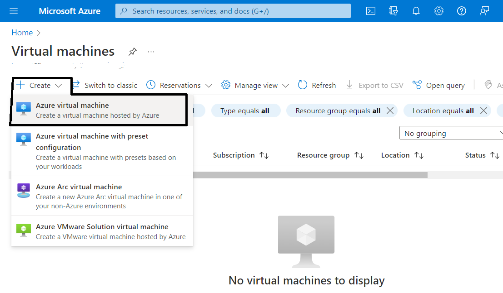

Create a new resource group or pick an existing resource group.

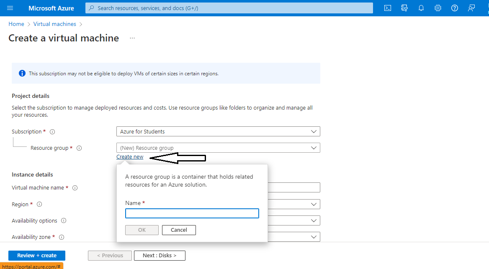

Fill and choose the remaining parameters; 
Virtual Machine name, 
Region should be one close to your location. 
For the sake of this tutorial, no Availability options is needed so pick  *No infrastructure redundancy required*. 
choose your preferred image *Ubuntu*. 
Choose your VM size 

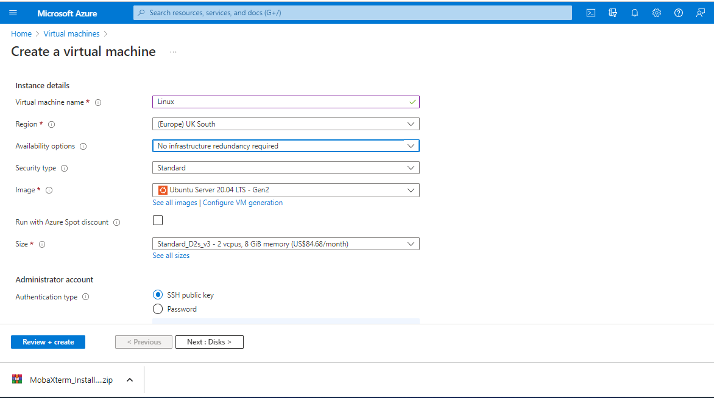

Choose your preferred mode of authentication. 
If you chose password it is very important to remember your username and password.
your password must contain uppercase letters, lowercase letters, numbers and must be 12 characters long.

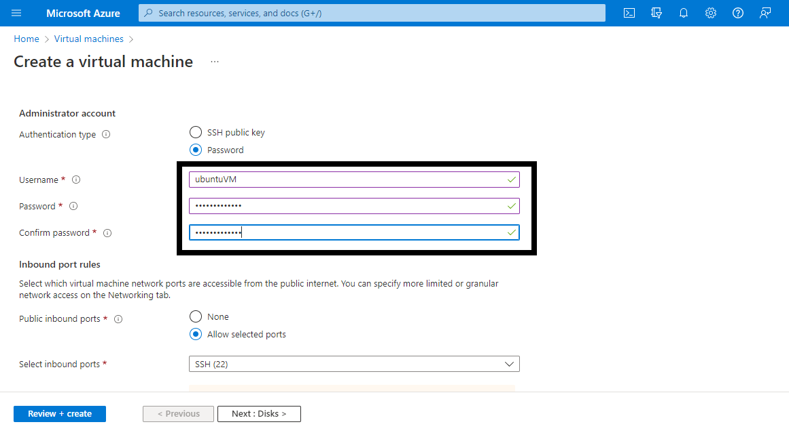

You can also use SSH key for authentication. you should also remember the username and keypair name or write and store somewhere safe.

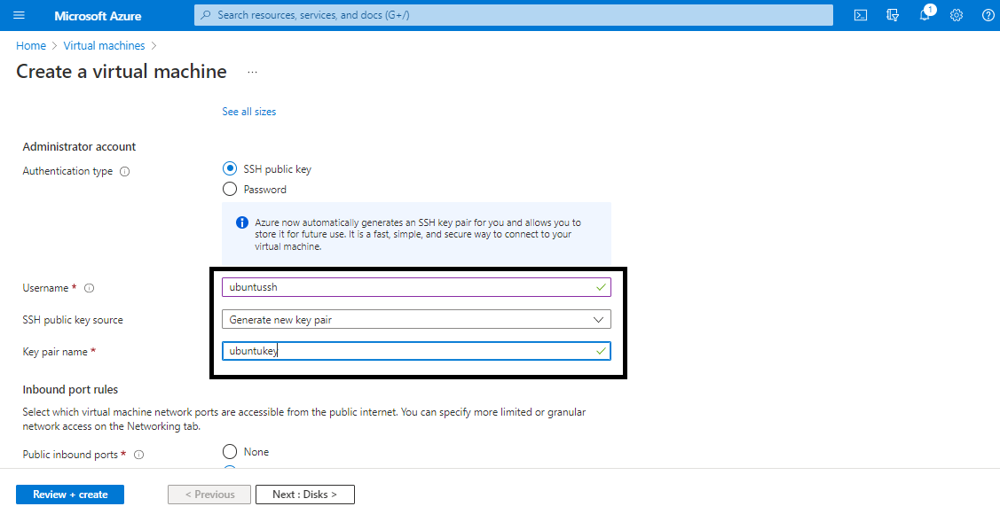

You can click *Review + Create* if you are satisfied or click next to adjust other settings like changing the disk type or implementing auto-shutdown among others

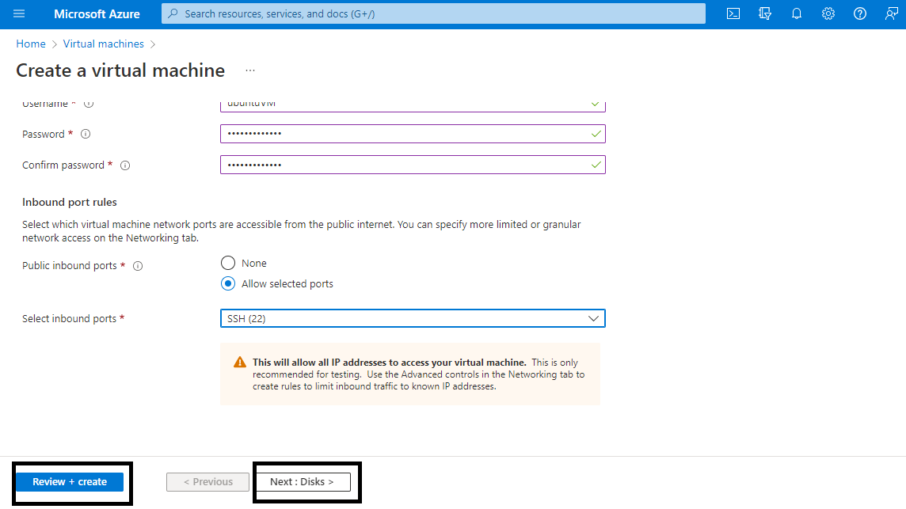

Review your parameters then click create at the bottom left when you are satisfied. Your VM will begin to deploy

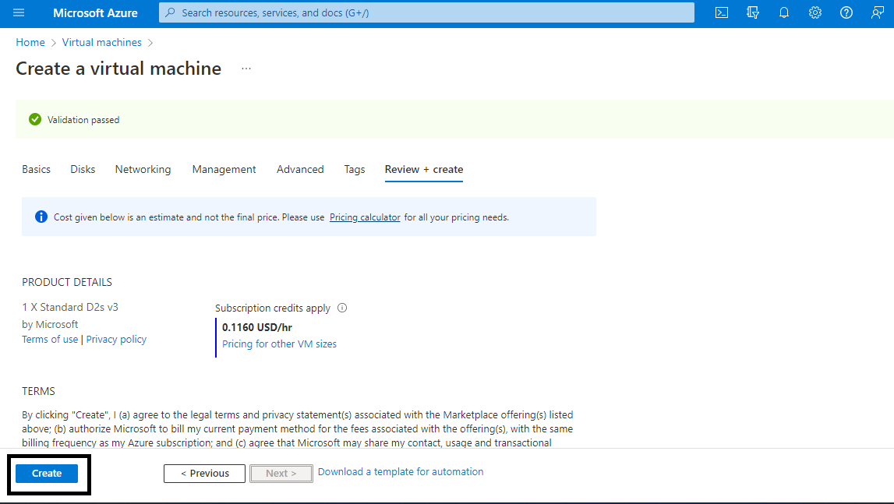

If you chose SSH key as your mode of authentication, you will be prompted to download your private key. Click on download and remember the location where it is stored on your computer.

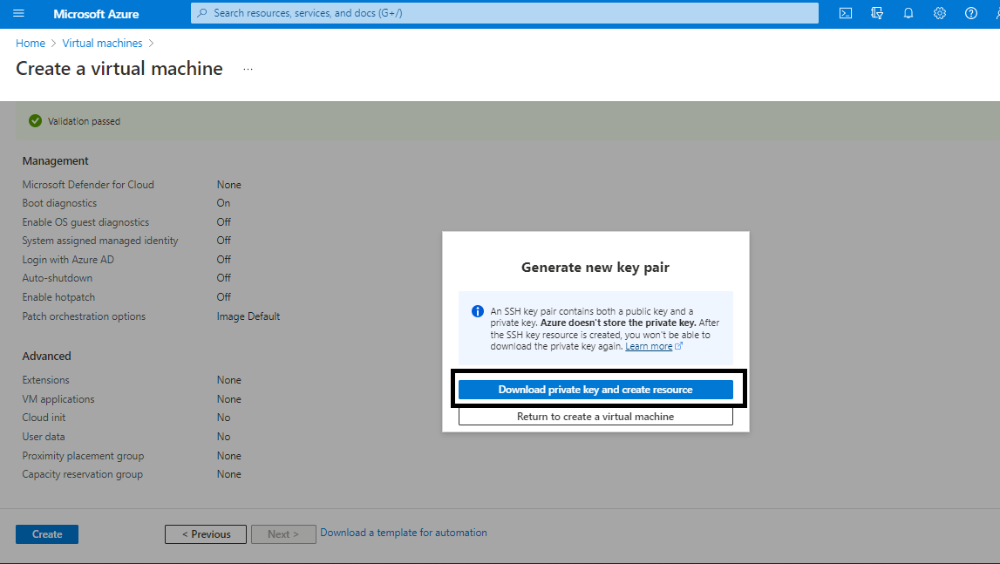

After Deployment click on *Go to resource*

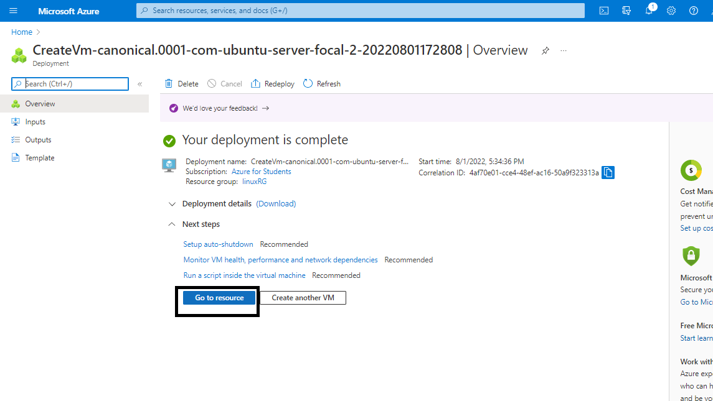
Copy the IP address located at the top right (different for each VM)

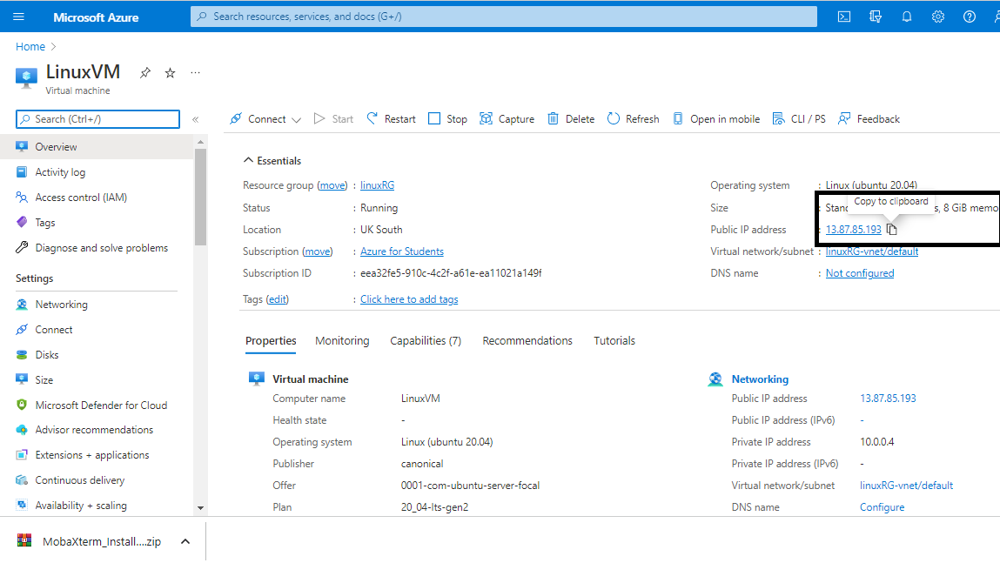

The next step is to download [MobaXterm](https://mobaxterm.mobatek.net/download.html) software and install it.
Open the app after installation. click on Session on the top left corner, click SSH and input the IP address copied earlier the tab for remote host. click OK

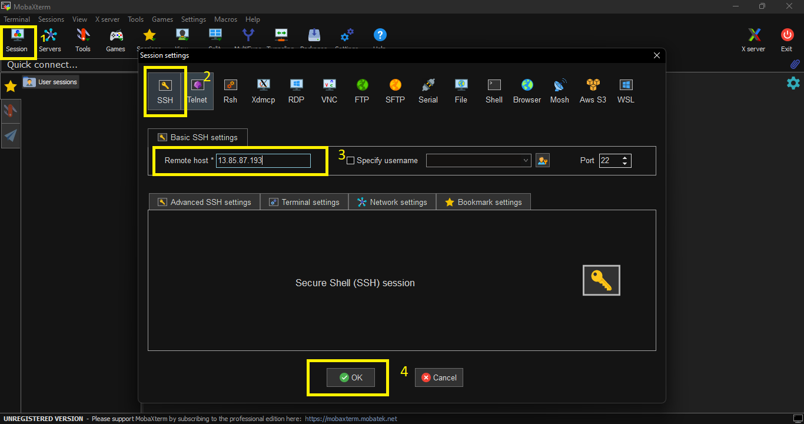

If you are using SSH key pair for authentication, after you input your IP address, click *Advanced SSH settings* tick the box for *use private key* and the import the private key downloaded earlier and click OK

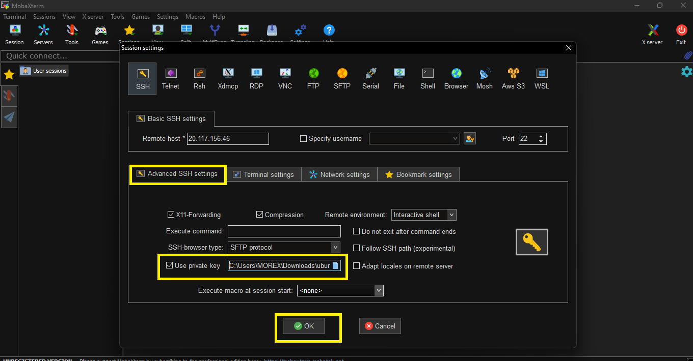

You will be required to provide username and password that was provided earlier in the authentication settings. you will be prompted to provide username only if you are using SSH key pair (Note that the no characters will be displayed on your screen when typing your password)

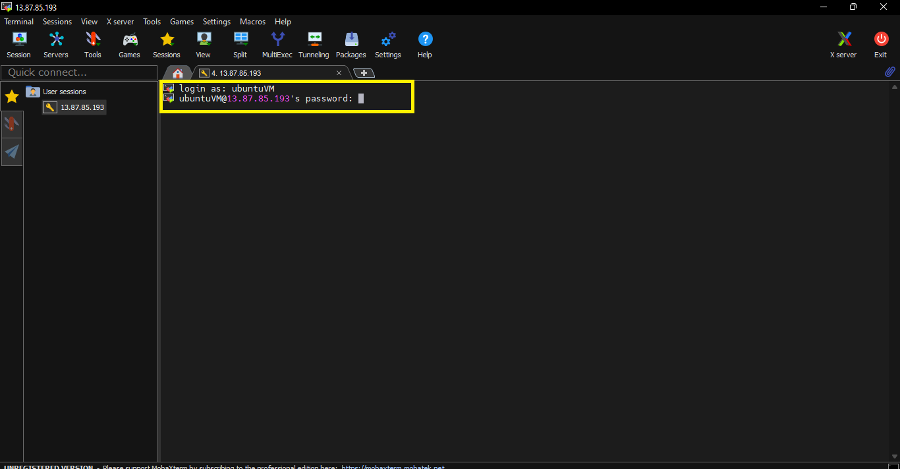
if the username and password provided is correct, you will be successfully logged into the Command Line interface of the Ubuntu VM and can run Linux commands

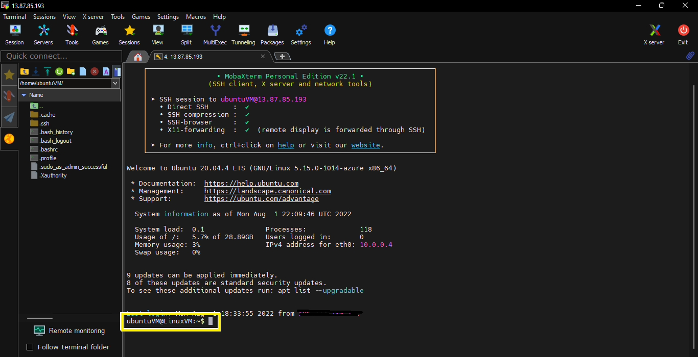

## Conclusion
Thank you for reading and I hope this article was helpful for you. Join me in my Cloud journey
[LinkedIn](www.linkedin.com/in/MuyideenMorenigbade)