# How to build and deploy container images in the Azure

ACR (Azure Container Registry) Tasks is a suite of features within Azure Container Registry that provides streamlined and efficient Docker container image builds in Azure. In this article, I used the *quick task* feature of ACR Tasks.

For this task, i will be working in the Azure CLI

1. Clone the GitHub original repository or the forked one using the "git clone" command
    
2. Change the working directory to the folder of the cloned repository
    
3. Set the environment variable for the registry name which will also be used for other resources in this task.
    
    (note that the registry name must be unique within azure and can only contain between 5-50 lowercase alphanumeric characters.)
    
    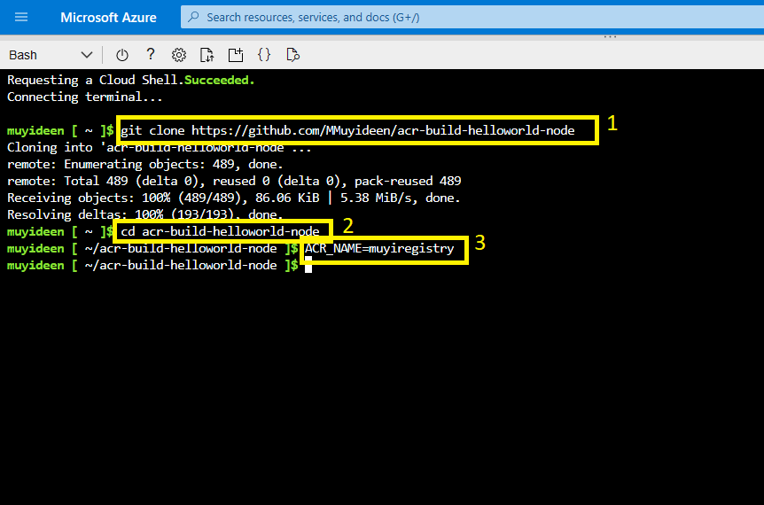
    
    The original GitHub repository to be forked for this task can be found [here](https://github.com/Azure-Samples/acr-build-helloworld-node)
    
4. Set the name of the resource group to be created as the acr name
    
5. Create the resource group where the resources will be grouped
    
6. Create the acr using the command as shown in the image
    
    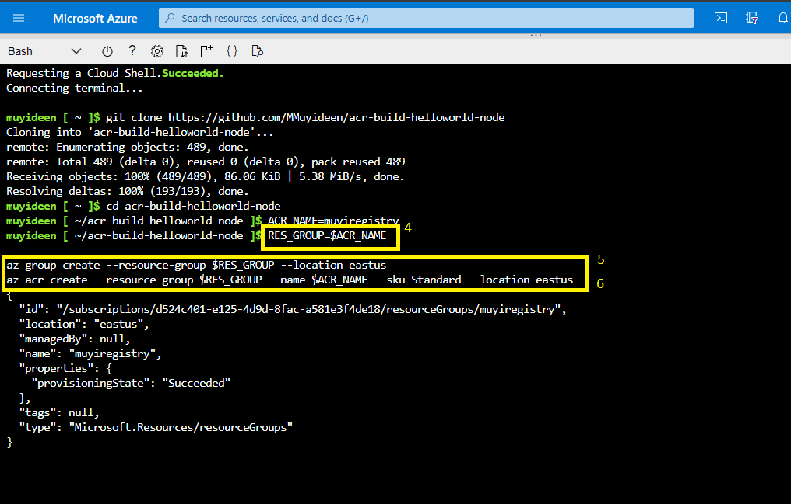
    
7. Use ACR Tasks to build a container image from the sample code. Execute the `az acr build` command to perform a quick task.
    
    From the output from the `az acr build` command. You can see the upload of the source code to Azure, and the details of the `docker build` operation that the ACR task runs in the cloud.
    
    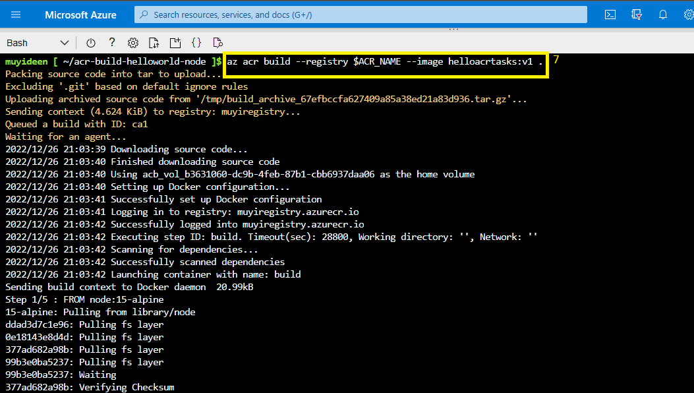
    
    ### **Deploy to Azure Container Instances**
    
    ACR tasks automatically push successfully built images into the registry by default, allowing immediate deployment from the registry.
    
8. create a key vault to store credentials
    
9. add vault to the acr variable to use as a name for the key vault
    
10. create the key vault using the az keyvault create command
    
    ```bash
    AKV_NAME=$ACR_NAME-vault
    
    az keyvault create --resource-group $RES_GROUP --name $AKV_NAME
    ```
    
    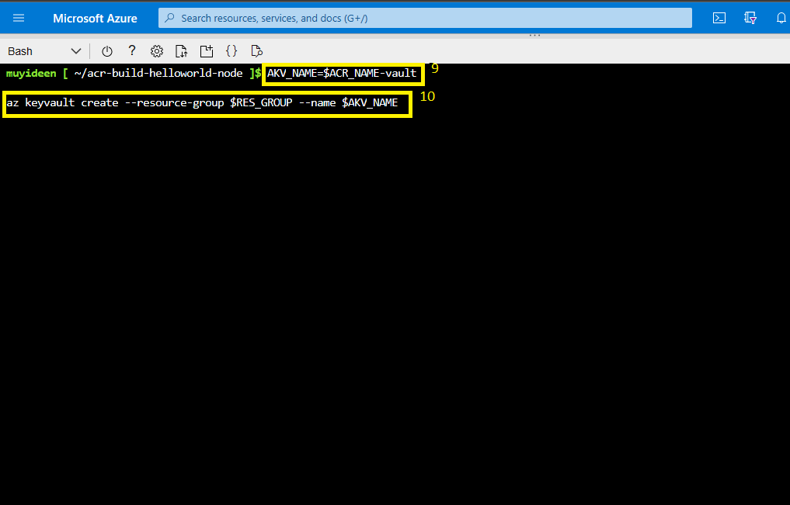
    
    #### **Create a service principal and store credentials**
    
    You now need to create a service principal and store its credentials in your key vault.
    
11. Use the `az ad sp create-for-rbac` command to create the service principal, and `az keyvault secret set` to store the service principal's **password** in the vault.
    
    ```bash
    # Create service principal, store its password in AKV (the registry *password*)
    az keyvault secret set \
      --vault-name $AKV_NAME \
      --name $ACR_NAME-pull-pwd \
      --value $(az ad sp create-for-rbac \
                    --name $ACR_NAME-pull \
                    --scopes $(az acr show --name $ACR_NAME --query id --output tsv) \
                    --role acrpull \
                    --query password \
                    --output tsv)
    ```
    
    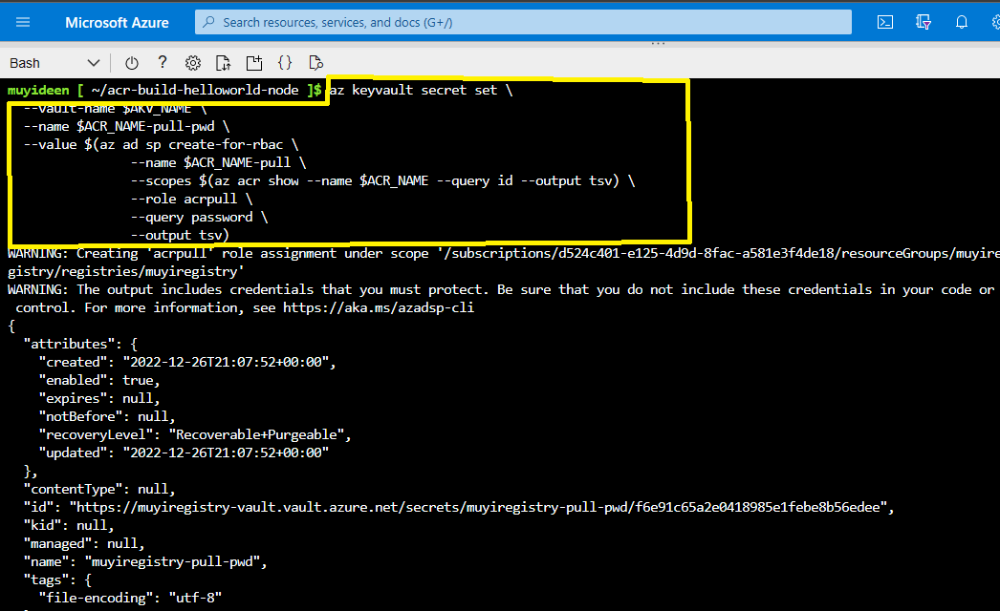
    
12. Next, store the service principal's *appId* in the vault, which is the **username** you pass to Azure Container Registry for authentication:
    
    ```bash
    # Store service principal ID in AKV (the registry *username*)
    az keyvault secret set \
        --vault-name $AKV_NAME \
        --name $ACR_NAME-pull-usr \
        --value $(az ad sp list --display-name $ACR_NAME-pull --query [].appId --output tsv)
    ```
    
    You've created an Azure Key Vault and stored two secrets in it:
    
    * `$ACR_NAME-pull-usr`: The service principal ID, for use as the container registry **username**.
        
    * `$ACR_NAME-pull-pwd`: The service principal password, for use as the container registry **password**.
        
    
    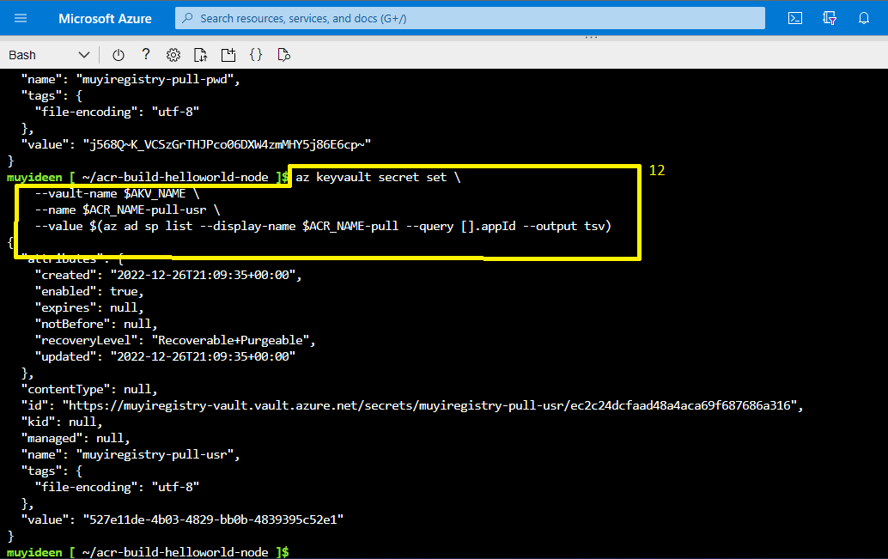
    
13. Execute the following `az container create` command to deploy a container instance. The command uses the service principal's credentials stored in Azure Key Vault to authenticate to your container registry.
    
    ```bash
    az container create \
        --resource-group $RES_GROUP \
        --name acr-tasks \
        --image $ACR_NAME.azurecr.io/helloacrtasks:v1 \
        --registry-login-server $ACR_NAME.azurecr.io \
        --registry-username $(az keyvault secret show --vault-name $AKV_NAME --name $ACR_NAME-pull-usr --query value -o tsv) \
        --registry-password $(az keyvault secret show --vault-name $AKV_NAME --name $ACR_NAME-pull-pwd --query value -o tsv) \
        --dns-name-label acr-tasks-$ACR_NAME \
        --query "{FQDN:ipAddress.fqdn}" \
        --output table
    ```
    
    The `--dns-name-label` value must be unique within Azure, so the preceding command appends the container registry's name to the container's DNS name label.
    
    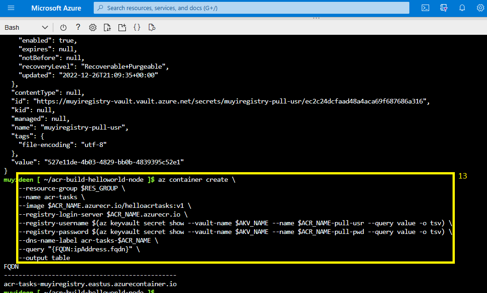
    
14. Take note of the FQDN
    
    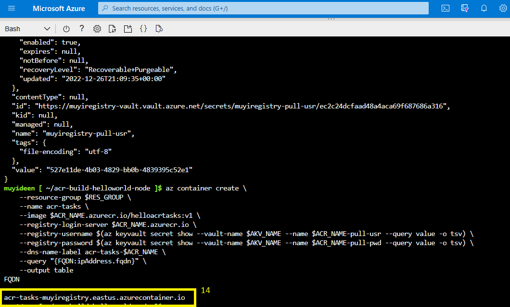
    
    ### **Verify the deployment**
    
15. To watch the startup process of the container, use the `az container attach` command
    
    ```bash
    az container attach --resource-group $RES_GROUP --name acr-tasks
    ```
    
    The `az container attach` output first displays the container's status as it pulls the image and starts, then binds the local console's STDOUT and STDERR to that of the container.
    
    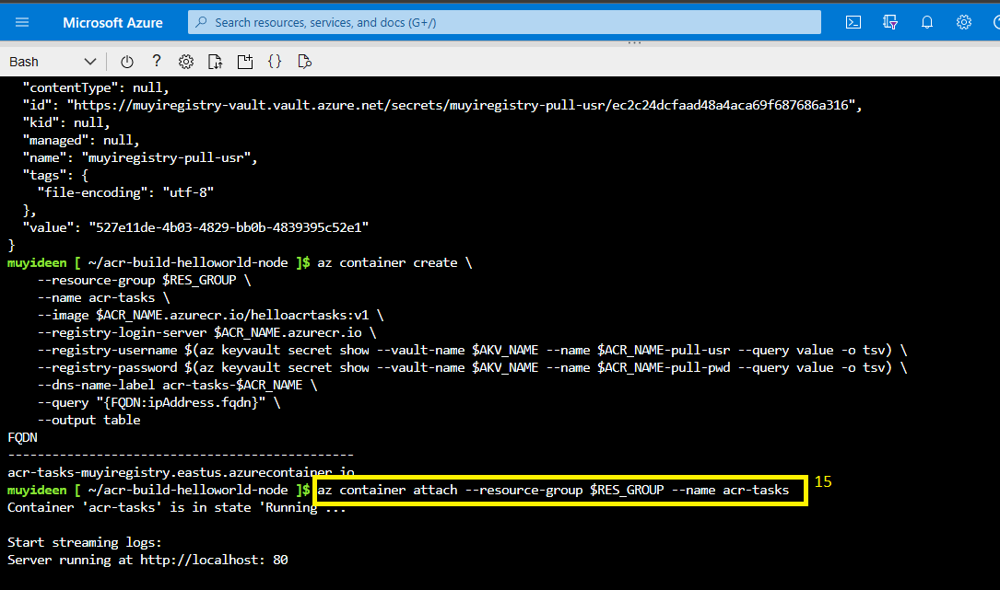
    
16. When `Server running at http://localhost:80` appears, navigate to the container's FQDN in your browser to see the running application.
    
    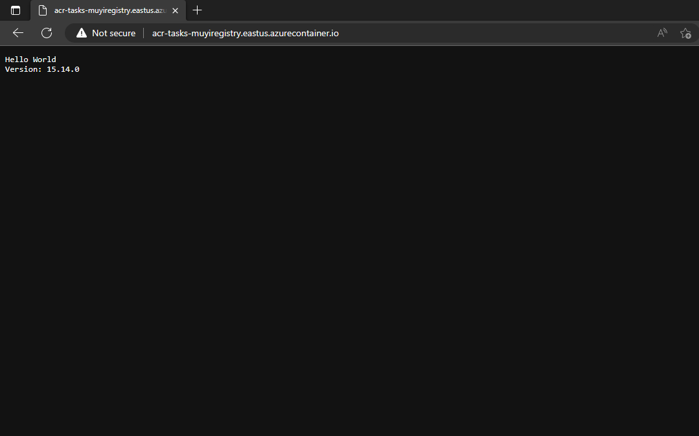
    
    To detach your console from the container, hit `Control+C`.
    
    ## **Clean up resources**
    
17. Stop the container instance with the `az container delete` command:
    
    ```bash
    az container delete --resource-group $RES_GROUP --name acr-tasks
    ```
    
    input `y` to confirm the action from the prompt
    
    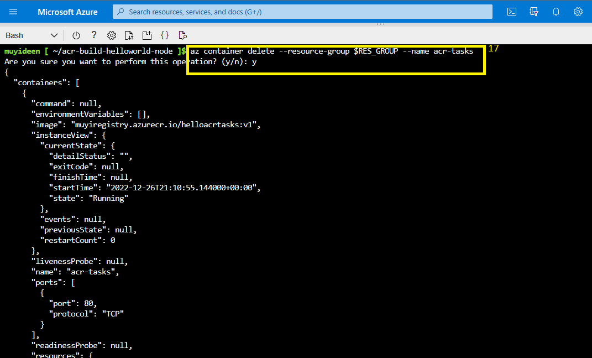
    
18. To remove *all* resources you've created in this tutorial, including the container registry, key vault, and service principal, issue the following commands.
    
    ```bash
    az group delete --resource-group $RES_GROUP
    az ad sp delete --id http://$ACR_NAME-pull
    ```
    
    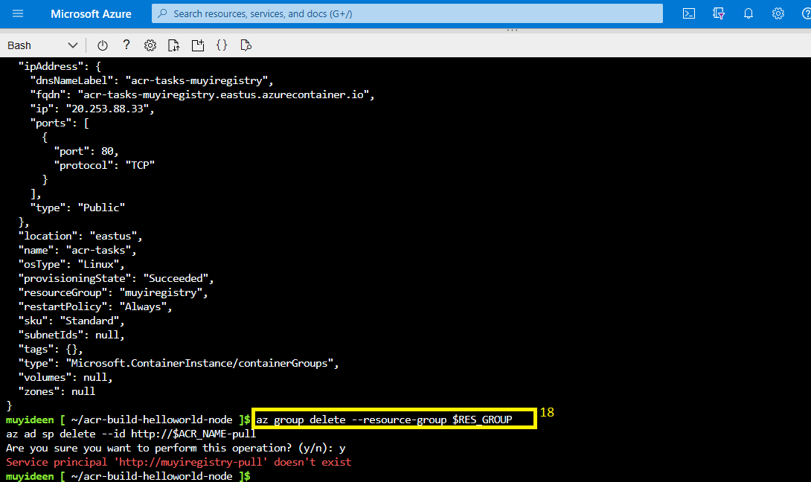
    
    Thank you for reading. connect with me on [Linkedin](https://www.linkedin.com/in/muyideenmorenigbade/)