Hello There, I am participating in [10 weeks of CloudOps Challenge](https://github.com/piyushsachdeva/10weeksofcloudops/blob/main/README.md) by [Piyush Sachdeva](https://www.linkedin.com/in/piyush-sachdeva/) and I am excited to share my journey through the fourth week's challenge with you all.

**INTRODUCTION**

Our task for this challenge was to deploy a web app to EKS cluster using Docker to build the container image, then use GitOps CICD to ensure seamless integration and delivery of the Application.

**Architecture Overview**

Before we dive into the task, here's a quick look at the architecture we aimed to build.

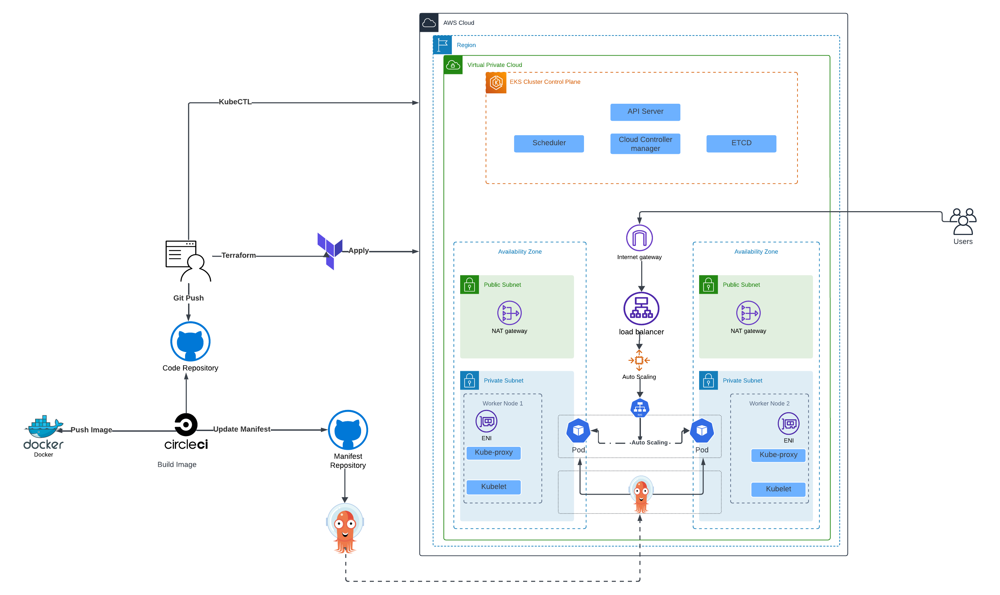

### EKS INFRASTRUCTURE SETUP

We will be using Terraform to deploy the EKS Cluster and dependent resources to ensure efficient deployment. The terraform modules can be found here. [https://github.com/MMuyideen/AWS-CloudOps-week4/tree/master/Terraform](https://github.com/MMuyideen/AWS-CloudOps-week4/tree/master/Terraform)

First we create an S3 bucket and DynamoDB table for the terraform remote state by running the `backend.init.sh` script in the repository.

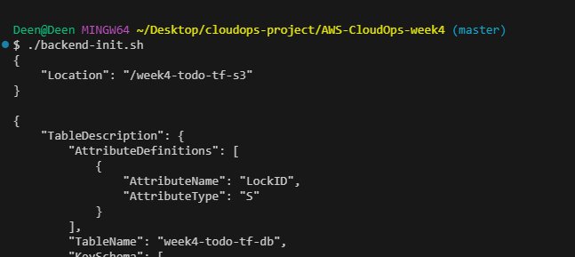

Then we update the backend.tf file with the name of the s3 bucket and dynamodb table.

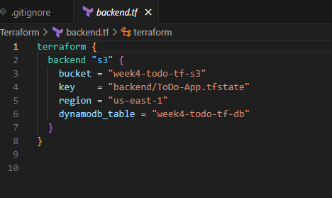

Next we create the `terraform.tfvars` for the variables.

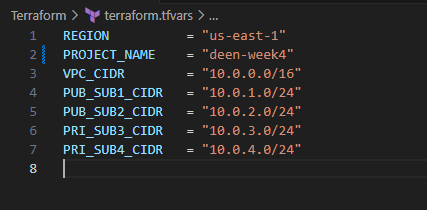

we initialize terraform in the terraform folder

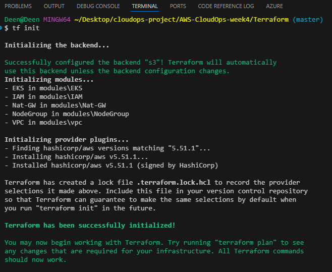

then we plan and apply the configuration

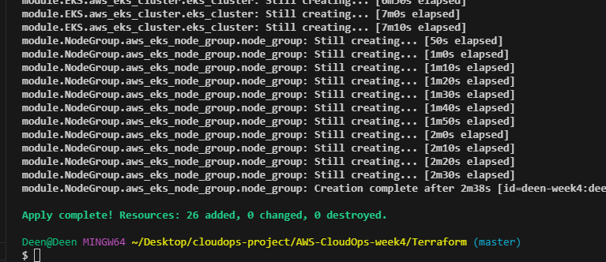

### APPLICATION SETUP

Now that our EKS is up and running in the cloud, we will now build our webapp locally and test. You can also find the App code here in the same repository which contains the Dockerfile as well. [https://github.com/MMuyideen/AWS-CloudOps-week4/tree/master/TODO](https://github.com/MMuyideen/AWS-CloudOps-week4/tree/master/TODO)

we can build the image by running the docker build command.

```bash
docker build -t deen-todo
```

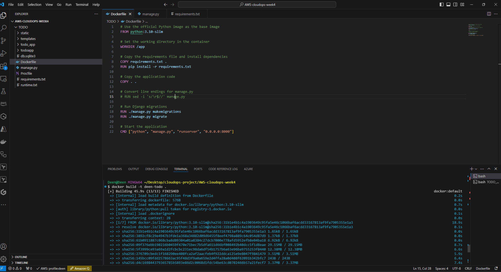

we can test the application locally to ensure it is running fine

```bash
docker run -p 8000:8000 deen-todo
```

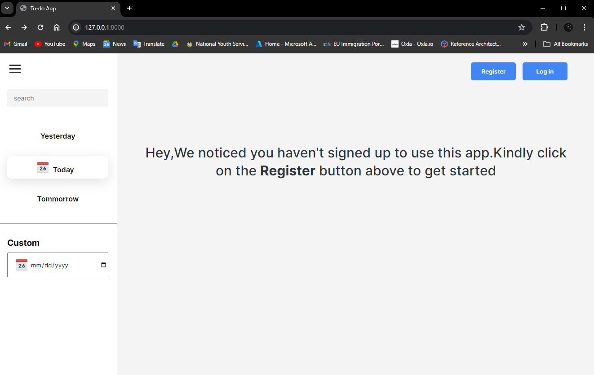

Now we tag and push the image to docker hub

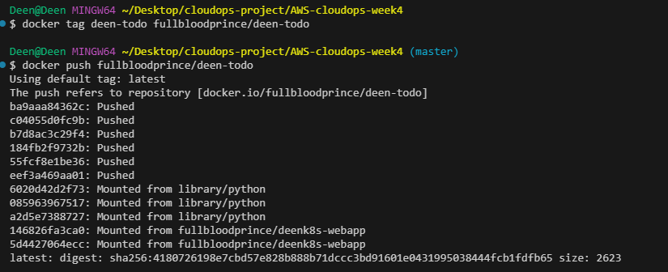

### PIPELINE SETUP

we create a new repository for the manifest files. we clone it locally to add the manifest files and push to github.

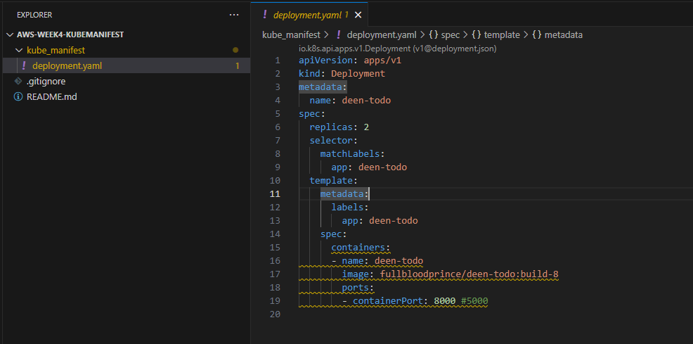

Then we create a `.circleci` folder in the main repository folder and a `config.yml` file.

```yaml
version: 2.1

orbs:
  python: circleci/python@2

jobs:
  build_and_push:
    docker:
      - image: cimg/python:3.8-node
    steps:
      - checkout
      - setup_remote_docker
      - run:
          name: Lets build and push image
          command: |
            version="build-$CIRCLE_BUILD_NUM"
            echo $version
            docker build -t fullbloodprince/deen-todo:$version ./TODO
            echo $DOCKER_PASSWORD | docker login -u $DOCKER_USERNAME --password-stdin
            docker push fullbloodprince/deen-todo:$version
  Update_manifest:
    docker:
      - image: cimg/base:2023.06
    steps:
      - checkout
      - setup_remote_docker
      - run:
          name: Updating Manifest file 
          command: |
            TAG=$CIRCLE_BUILD_NUM
            ((TAG--))
            git clone https://github.com/MMuyideen/aws-week4-kubemanifest.git
            cd aws-week4-kubemanifest
            git config --global user.email "dejimorenigbade@gmail.com"
            git config --global user.name "Muyideen"
            echo $TAG
            sed -i "s/build-.*/build-$TAG/g" kube_manifest/deployment.yaml
            git add .
            git commit -m "new build with imgTag build-$TAG"
            git config credential.helper 'cache --timeout=120'
            git push -q https://$GITHUB_PERSONAL_TOKEN@github.com/MMuyideen/aws-week4-kubemanifest.git
workflows:
  GitOpsflow:
    jobs:
      - build_and_push
      - Update_manifest:
          requires:
            - build_and_push
```

The configuration file will be used by circleci to build the docker image, update the tag, and update the manifest repository to use the latest build.

Then setup a new project in circleci

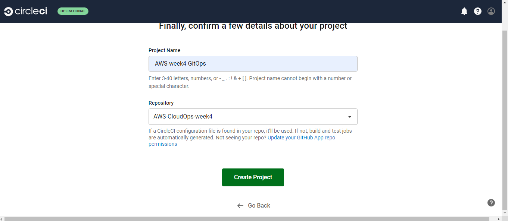

then we add environment variables which will be used by the workflow

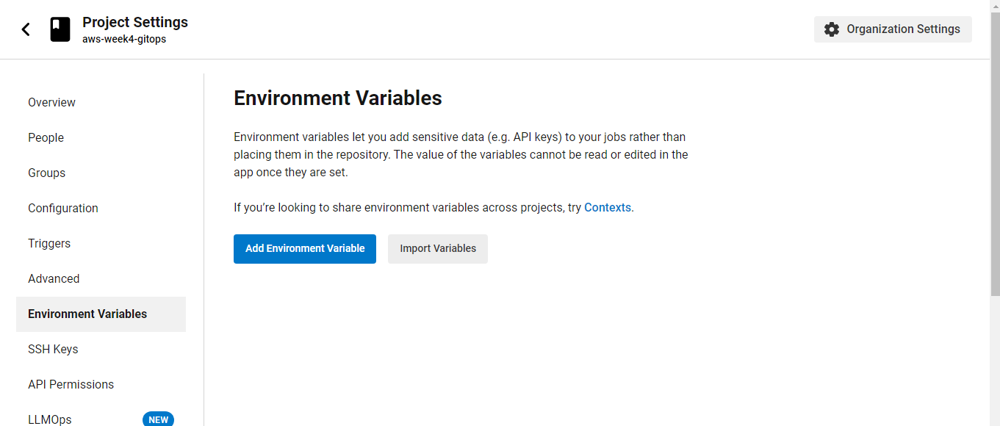

We also a github token which the circleci will use to authenticate to make changes to the repository.

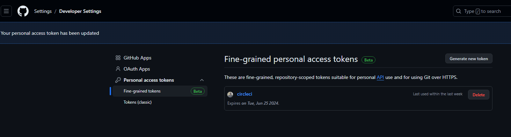

Finally, we run the workflow in circleci

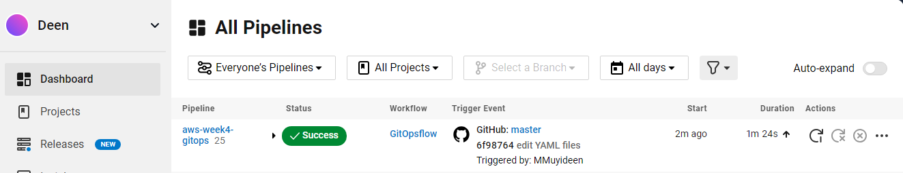

### ARGOCD deployment

First thing we need to do is create a kubeconfig for the EKS cluster by running the below command

`aws eks update-kubeconfig --region $REGION --name $CLUSTER_NAME`

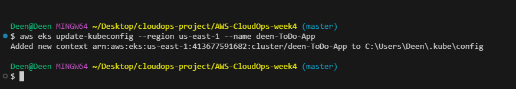

Then we are ready to install ArgoCD in our EKS cluster to sync cluster state.

we do that by completing the following steps

* Creating an ArgoCD Namespace and Installing ArgoCD
    
* Patching ArgoCD Server to use a load balancer
    
* Obtaining the Server IP and Password
    
* Creating and Applying the ArgoCD Sync Manifest File
    

```bash
kubectl create namespace argocd
kubectl apply -n argocd -f https://raw.githubusercontent.com/argoproj/argo-cd/stable/manifests/install.yaml

kubectl patch svc argocd-server -n argocd -p '{"spec": {"type": "LoadBalancer"}}'

ARGO_SERVER=$(kubectl get svc argocd-server -n argocd -o jsonpath='{.status.loadBalancer.ingress[0].hostname}') # Get argocd server url
ARGOCD_PASSWORD=$(kubectl -n argocd get secret argocd-initial-admin-secret -o jsonpath="{.data.password}" | base64 -d) #get argocd server password
echo "ARGOCD_SERVER: $ARGO_SERVER"
echo "ARGOCD_SERVER PASSWORD: $ARGOCD_PASSWORD"
```

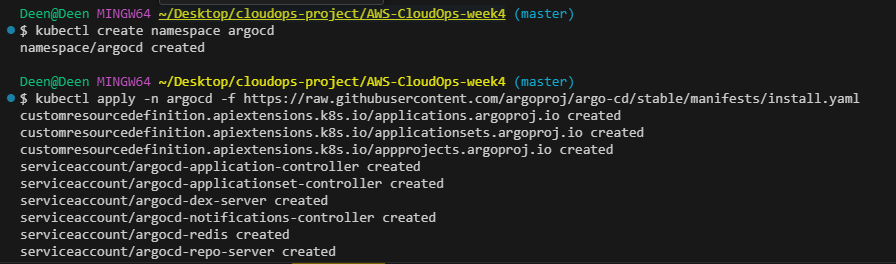

Here is the load balancer created by argocd

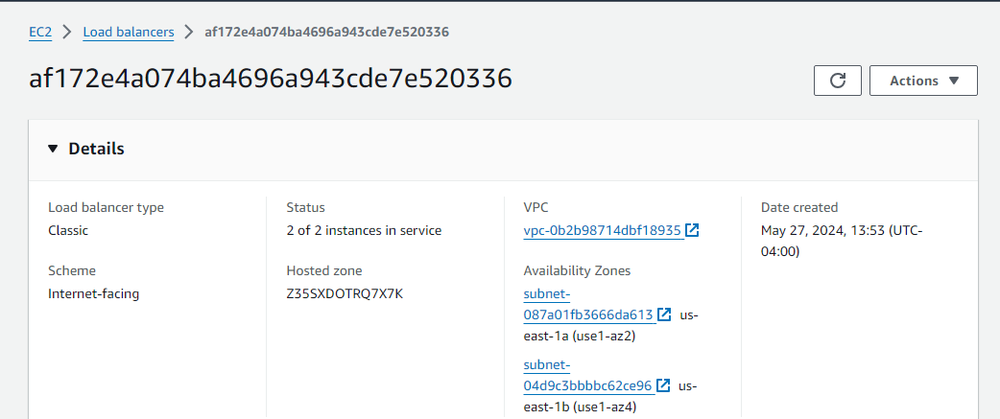

then we run the below command to deploy our application.(make sure to reference the file properly or run form the same directory)

`kubectl apply -f argocd-sync.yaml`

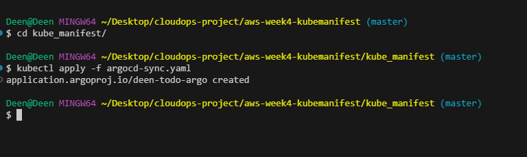

We can access the argocd ui from the url shown earlier and login with admin as the default username and extracted password.


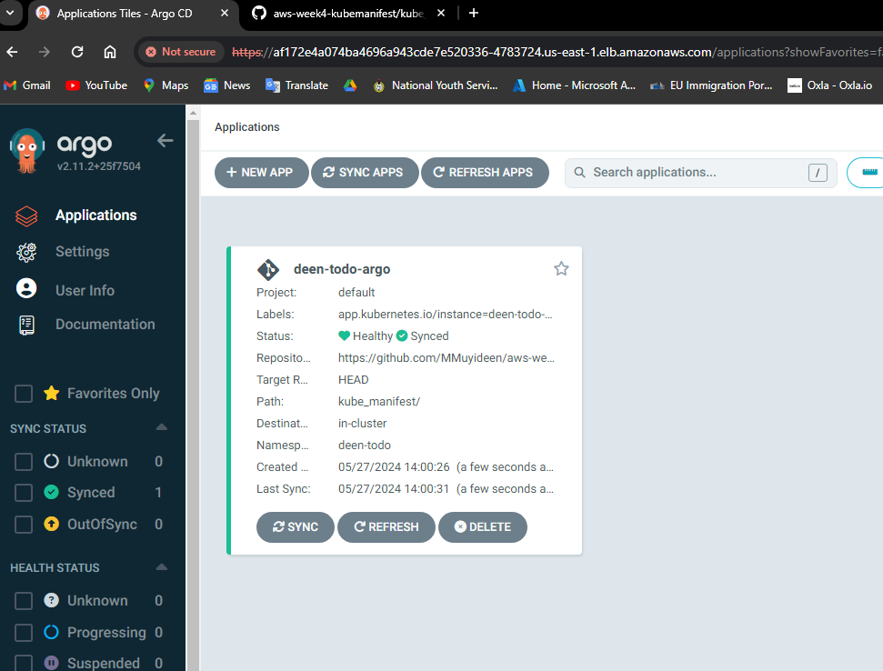

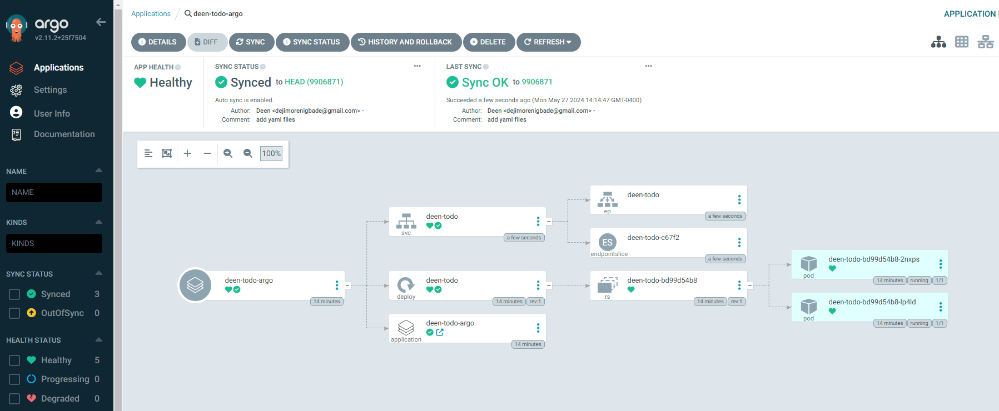

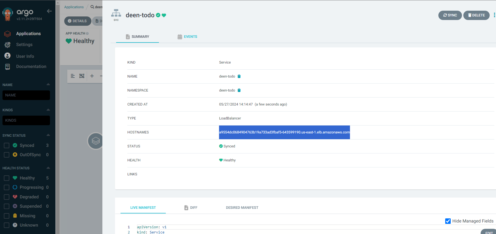

We can now access the application from the load balancer url

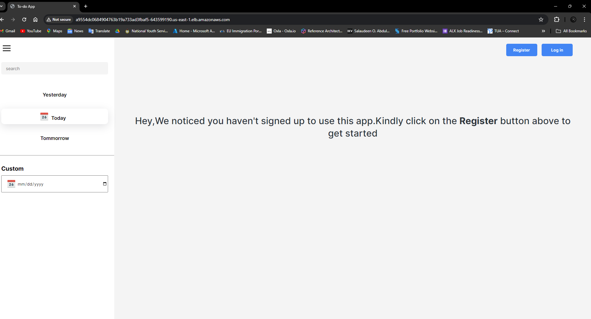

### TESTING

To test the pipeline, we will make some changes to the Application code and push to Github. In this case I added the Repository link and Architecture diagram to the home page.

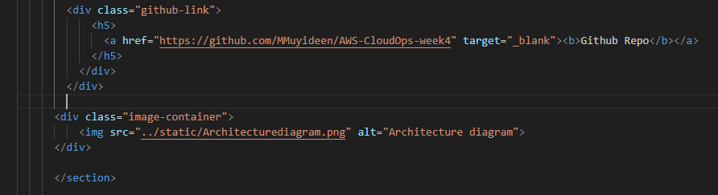

Below is the result after successful pipeline run.

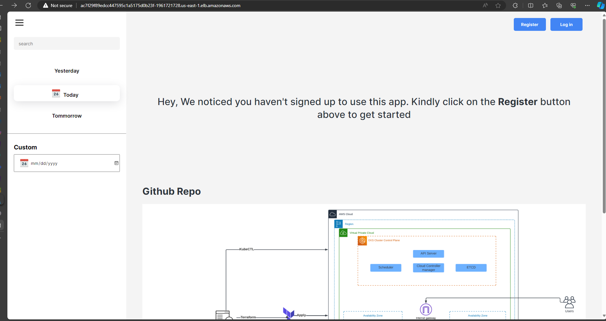

### CONCLUSION

### CLEANUP

To clean up the resources, we delete the terraform configuration by running the terraform destroy -auto-approve command . then we delete the S3 bucket as well as DynamoDB table for the the state file.