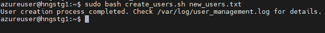
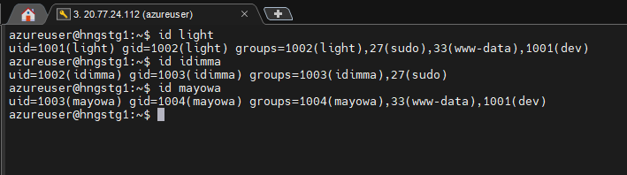
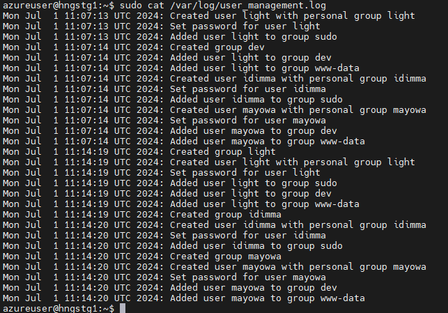
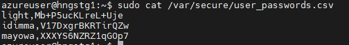
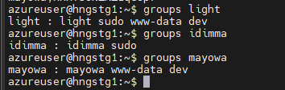

# Automate User and Group management in Linux using Bash script

Streamline User Creation, Group Creation and Assignment, and Password Management in a Linux Environment.

### Introduction

My name is Muyideen and I am currently undergoing [HNG Internship](https://hng.tech/internship). A fast-paced 10-week online internship where tech skills are validated.

### The Challenge Requirements

The task was to create a bash script that reads a text file containing usernames and group names, creates users and groups accordingly, sets up home directories, generates random passwords, and logs all actions.

* Each user must have a personal group with the same name as the username.
    
* Users can belong to multiple groups, separated by commas.
    
* Usernames and groups are separated by a semicolon in the input file.
    
* The script must log actions to `/var/log/user_management.log` and store passwords in `/var/secure/user_passwords.csv`.
    

### The Solution

You can see the full script here in this [GitHub repository](https://github.com/MMuyideen/hng-stage2).

to run the script first make sure it is executable by running `chmod +x create_users.sh`

then run `create_users.sh user_groups.txt`

1. The first if block checks if the command is inputted correctly by stating the txt file that contains the user and groups.
    
    ```bash
    #!/bin/bash
    
    # File: create_users.sh
    # Description: This script creates users and groups based on input from a text file.
    # Usage: sudo ./create_users.sh <input-file>
    
    # Check if the input file is provided
    if [ $# -eq 0 ]; then
        echo "Please provide an input file"
        echo "Usage: $0 <input-file>"
        exit 1
    fi
    ```
    
2. Next, we set variables for the log file and the password store. we also create the files in case they don't exist and set permissions.
    
    ```bash
    INPUT_FILE=$1
    LOG_FILE="/var/log/user_management.log"
    PASSWORD_FILE="/var/secure/user_passwords.csv"
    
    mkdir -p /var/secure
    touch $LOG_FILE
    touch $PASSWORD_FILE
    chmod 600 $PASSWORD_FILE
    ```
    
3. The below command is used to log the operations sequentially by the date and time it was performed.
    
    ```bash
    log() {
        echo "$(date): $1" >> $LOG_FILE
    }
    ```
    
4. First, we create a function for the username and group. define local variables for the function to create the username and groups. Then we check if the user or group already exists so we can skip it.
    
    ```bash
    create_user() {
        local username=$1
        local groups=$2
    
        # Check if user already exists
        if id "$username" &>/dev/null; then
            log "User $username already exists. Skipping creation."
            return
        fi
    
        # Create a group for the user if it doesn't exist
        if ! getent group $username > /dev/null 2>&1; then
            groupadd $username
            log "Created group $username"
        fi
    ```
    
5. Then we create the user with the personal group `-g` and home directory `-m.` Then we generate a random 12-character password assign it to a user and store it to the file.
    
    ```bash
    
        # Create a user with a personal group
        useradd -m -g $username $username
        log "Created user $username with personal group $username"
    
        # Set random password
        password=$(openssl rand -base64 12)
        echo "$username:$password" | chpasswd
        echo "$username,$password" >> $PASSWORD_FILE
        log "Set password for user $username"
    ```
    
6. Then we Check if the groups variable is not empty, Split the groups string into an array, Iterate over each group in the array and Create group if it doesn't exist. using the `usermod` command, we add each user to the group.
    
    ```bash
        # Add user to additional groups
        if [ ! -z "$groups" ]; then
            IFS=',' read -ra GROUP_ARRAY <<< "$groups"
            for group in "${GROUP_ARRAY[@]}"; do
                # Create group if it doesn't exist
                if ! getent group $group > /dev/null 2>&1; then
                    groupadd $group
                    log "Created group $group"
                fi
                usermod -aG $group $username
                log "Added user $username to group $group"
            done
        fi
    }
    ```
    
7. Main Execution. we read each line of the input file splitting on `";"`. `[ -n "$username" ]` ensures the last line is read even without a new line. Then we use the `xargs` attribute to remove the trailing whitespace.
    
8. ```bash
     # Main execution
     while IFS=';' read -r username groups || [ -n "$username" ]; do
         # Remove leading/trailing whitespace
         username=$(echo $username | xargs)
         groups=$(echo $groups | xargs)
    ```
    
9. Finally, we call the create\_user function and the &lt; feeds the contents of the file to the loop.
    
    ```bash
        create_user "$username" "$groups"
    done < "$INPUT_FILE"
    ```
    

### TESTING

After running the script with the command `./create_users.sh user_groups.txt`



To validate the users created we run `id <username>`. It will show the user names and their groups.



Then we verify the home directories created by running the `ls /home`


Then we check the logs by running `sudo cat /var/log/user_management.log`



We also verify the passwords for each user by running `sudo cat /var/secure/user_passwords.csv`



Lastly, we can verify group ownerships by running `groups <username>`



**Conclusion**

This script demonstrates how bash can be used to automate complex system administration tasks.

For those interested in joining similar projects and gaining hands-on experience, check out the HNG Internship at [https://hng.tech/internship](https://hng.tech/internship).

